The History of ùkidek
=====================

Year 1 of ùkidek, diary of overseer Grahar Vabôktad
---------------------------------------------------

### 15th Granite, 250
We finally arrived at the place where the great fortress of ùkidek waits to be built. As mentioned before, we will build this fortress at the border between a lush forest and a loamy wasteland. The journey so far was uneventful but annoying. Let's dig some caves to I can sleep underground again as the gods intended.

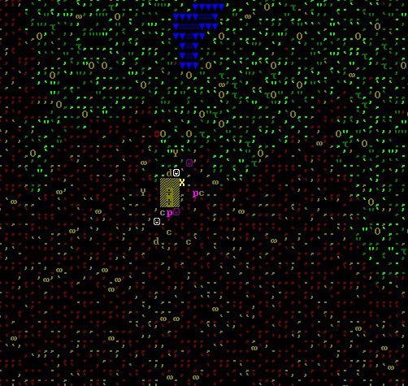

We need to work fast, you never know when a necromancer decides to add your body to their collection of animated corpses. I ordered Rovod, our miner, to dig a tunnel. While Rovod is digging, Sazir the woodworker can cut down some trees. Since no one is sick or wounded yet, I told Lolor, our medical dwarf, to gather some useful plants. Once we have dug out some stone or fell some trees, we can start making doors and furniture.

After I gave those orders, Kadol the Architect came to me: ”Grahar, we have to pickaxes. Wouldn't it be faster if two dwarves dig at the same time?“.

Congratulations Kadol. You are now our stand-in miner.

### 16th granite, 250
Four layers deep, we finally hit massive rock. So far we have sandy loam (pretty much useless except for farming), sand (which means we can make class) and clay loam, which means we have will be able to sell cheaply produced pottery later on.

The fourth underground layer is mudstone. At least it's better than actual mud.

### 21st Granite, 250

We found limonite which apparently is an ore of iron. For now we ignore this vein and dig our entrance hall.
The design of the entrance hall is difficult. We need to create useful rooms quickly. We need our entrance hall to be secure against outside threats. We need our entrance hall to be wide enough for the merchants' wagons.

The first requirement would be fulfilled with a short narrow entrance. The second requirement would be fulfilled with a long narrow entrance with many traps. The third requirement would be fulfilled with a short, wide entrance without traps.

I decide to compromise. The entrance hall will be long. It will be narrow for now, so the first few caravans will be unable to use wagons. The entrance hall can be extended later on, when we installed a drawbridge to lock down. The traps will be installed in a way that the wagons can drive around them but blindly charging invaders will run right into them.

Since I have not much to do so far, I made some blueprints for the upcoming entrance hall:

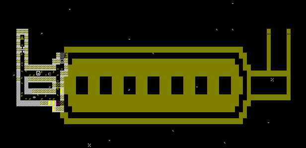

Ingish the mason has created the first door which I orderd to be placed in the entrance hall

### 25th Granite, 250

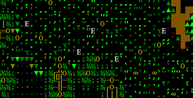

Aparently, elephants roam this area. Today we saw a few of them. Somewhat disturbing, but I have been told that those stries about elephants that murder scores of dwarves are only a legend and that they are actually rather peaceful animals.

We should still place some cage traps later on. One elephant can feed the fortress for some time and even give use valuable ivory. Maybe we can even start breeding them. But for now, we just ignore them, just like they ignore us.

### 23rd Slate, 250

Finally! We have dug out the hall that will later become the trade depot hall. There is enough space to put all of our supplies, so we are not cut off from our stuff if something attacks us and we have to lock the door. Next we will dig some rooms for growing food and an office for me. How am I supposed to keep our stocks up to date if I don't even have a chair to sit on?

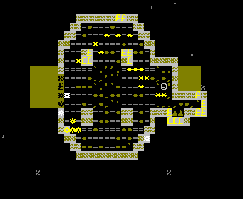

### 18th Felsite, 250

We have trouble getting things done. We are here for more than two month now, and we don't even have places too sleep yet. At least we managed to create some underground farm plots. We dug out space for the kitchen and the still, which are under construction.

Right now, our miners are working on on my office, so I can get some work done. Next ine line are the bedrooms, then the workshops. Sazir already constructed beds, so we don't need the workshops before the bedrooms.

I plan the great hall to be three stories tall, but this is a thing for the future.

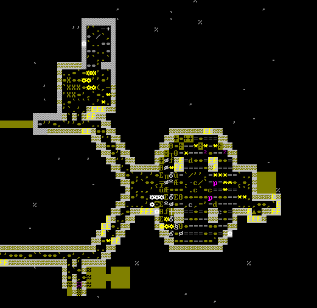

### 4th Hematite, 250

It is summer. Or it would be summer, in this climate it makes almost no difference. My office is finally usable, I have a bedroom and the other dwarves' bedrooms are dug out.

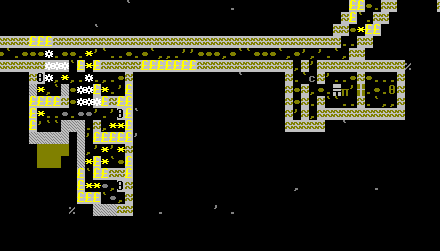

### 28th Hematite, 250

Migrants. Seven of them, and we don't have enough rooms.

Remember what general Sengnish said? We would get volunteers? Well, we got them. One of them is a great clothier, but this is hardly what we need now. One of them is a furnace operator and we don't even have furnaces at this point. One of them is fisher, so we can at least make our meals more interesting (once we have a place for fish cleaning). One is a plant processor, the other ones are pretty much useless. I assign one of them to stone detailing, one of them to stone crafting (so we have something to trade) and one of them to mining. Kadol is very happy about this. I plan to have the first bridge finished by the end of the year, so we need him as mechanic an architect.

Oh, and they brought pets. A cavy pup and a goat kid. Since we have no pastures underground yet, they have to be pastured outside, along with the yaks that pulled our wagon. Which means they will probably get killed on the first attack, which means there owners will be pissed. Great.

### 8th Galena, 250

The migrants work well. We don't have room for everyone yet, but our pub is almost usable, we have a mechanic's workshop and a craftsdwarf's workshop. Our stonecrafter has already assembled a nest box, so we may get eggs from our chicken soon.

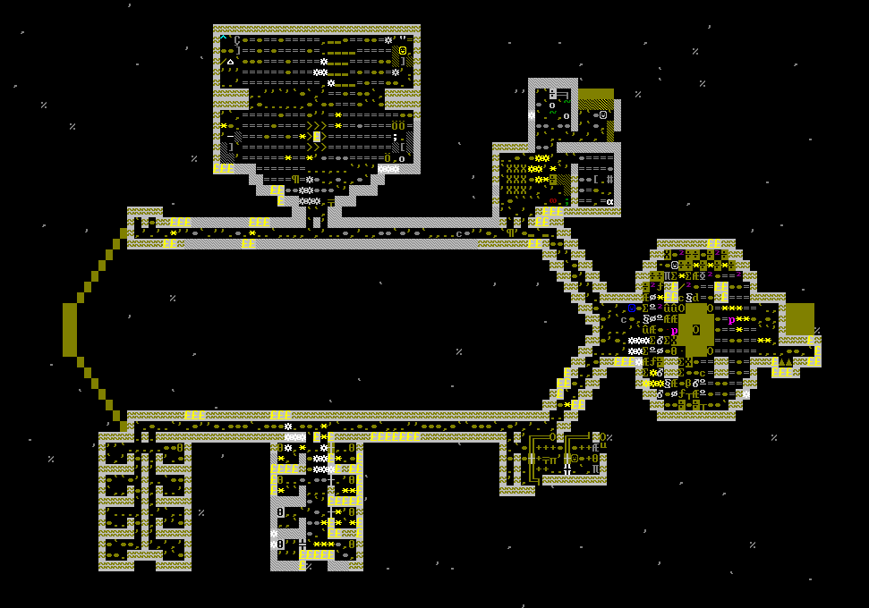

### 1st Limestone, 250

Autumn has arrived. Several workshops are set up, we have mussels and eggs as addition to our diet.

Our current bottleneck is our mason, Ingish. We have a high demand on stone furniture such as cabinets, coffers and doorrs and Ingish cannot keep up. We have dug out rooms for everyone, including potential immigrants this autumn but we cannot use these rooms yet due to lack of doors.

We are somewhat low on drinks, partially because we don't have many barrels or stone pots. Our Stonecrafter made some, so we should be fine. Nevertheless, when the caravan comes, I should buy some food and drinks so we can make it over the winter. The weather above ground may stay warm in the winter, but underground only plump helmets continue to grow.

I think I should lock in our chicken. Maybe when they are undisturbed, chicks will hatch from the eggs.

### 3rd Limestone, 250

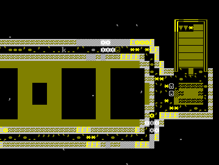

Today we caught a kobold trying to sneak into our fortress. Not that we have things worth stealing yet, but I thought kobolds were almost extinct. Still Tekkud, one of the new guys, identified it as a kobold. I remember hearing that kobolds are very adept in avoiding traps, so we need another defence. Fortunately, we brought two dogs, so if we train them and place them in entrance (in a place safe from zombies, of course), those kobolds will have no chance of getting in.

We have no animal trainers yet, so I will try to do this myself. How hard can it be?

I also officially declared our dining hall as meeting hall and as an inn. I hope that musicians visit from time to time, that would be good for everyone's moral.

### 9th Limestone, 250

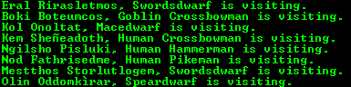

Uh-oh. Several mercenaries are visiting. This would be a good thing if not for the low booze stocks. Maybe I shouldn't have opened the inn so early.

However, the damage is done. Thanks to some rock pots, we were able to brew some more drinks, so we are not in immediate danger of dehydration. And if we can convince those bunch of muscles to fight for us, we may be a step closer to conquer some necromancer's towers.

### 11th Limestone, 250

The outpost liaison and a trading caravan have arrived. Finally. We don't have much to sell yet, only a handful of low-quality rock trinkets (our stonecrafter was occupied crafting useful stuff most of the time) and some spiked wooden balls, which Sazir made out of boredom early this year when we were waiting for our miners to dig far enough.

### 13th Limestone, 250

I just had a meeting with the outpost liaison. We shared som rumours about what is going on in the world and what the caravan should bring next year. Here is a short list:
- leather (you can always use leather, and getting useful amounts of leather is hard, since we don't have a lot of livestock yet.
- cloth (plant, silk and yarn, reason: see leather)
- bituminous coal (when we want to make steel, we need coal. Not sure if we find some here)
- charcoal and coke (same)
- sheets (for all the paperwork I need to do)

She also told me what will probably yield a lot of money next year. Among it are toys and scepters. We should tell our Stonecrafter.

There are rumours that the elves of the Lakes of Meditation conquered some of our settlements. This is alarming. Fortunately, the elves of the Familial Wisps that live close to us are at peace and will probably send a trading caravan next spring. I heard they are talented in taming strange beasts, maybe they have something interesting.

### 14th Limestone, 250

Today I the merchants were finally done unloading their goods. I bought an anvil, some leather, some cloth, a bronze pick so we can equip another miner, some parchment, something to read, some copper bars (in case some dwarf enters a strange mood and requires metal), lots of food and a boar. It is amazing how well they liked those spiked wooden balls. The elves in the spring won't like them, so we should have enough stone crafts finished by that point.

### 15th Limestone, 250

A yak calf and a puppy were born today. Which reminds me that I still want to train thos dogs to guard our entrance.

I realize that we should create an indoor pasture for our yaks and the pets. So far however, the usual funghi that tend to cover every muddy bit of cave floor at home don't grow on the soil we have underground. Lolor says we should dig until we find a natural cave to set free the funghi spores down there. This sounds valid, but I don't want to risk opening a cave yet. Who knows what beasts lurk down there?

### 24th limetsone, 250

They told me I did not have the skill to train a war dog! They called me mad! Mad! But I showed them! We now have to war dogs on leashes close to the trade depot. Nothing gets past them without being noticed. I even think they should be able to take out a kobold all by themselves.

Several animals have been born in the past few days. After the puppy that I mentioned earlier, the cat gave birth to three kittens and the sow now has a piglet.

The bridge t — wait a moment someone just told me that migrant just arrived. I have to see if they are useful.

### 24th limestone, 250 addition

Lêgan be praised! One of the newcomers is a èzum Ushattishis, a legendary armorsmith. The other one is a brewer. Currently Oddom brews our drinks, but none of us, including himself is happy with this. Now Oddom can concentrate on becoming a good cook while Ushat makes delicious booze.

The other three migrants are the children of the èzum. Nish, his daughter is eleven years old, so she will soon be able to help around the fortress. The other kids are one and two year old.

By the way, èzum is the son of Rovod îtonshedim, our outpost liaison (not to be confused with Rovod Kogankegeth, our miner). Which means I should really thank Rovod that she apparently trusts us enough to convince here son and grandchildren to live in this fortress.

It is worth noting that our brewer brought a pet duckling. The duck does not need a pasture, fortunately and can live underground where it is safe. It is a female duck, so once it grew up, we will have duck eggs. We also got a baby llama which I put on the pasture along with the other grazing animals.

### 28th Limestone, 250

After some complaints about the pigs in the dining hall, I let the miners dig out a room for them above the kitchen.

### 7th Sandstone

Today I found out why the mercenaries are here. Apparently, they don't look for jobs, most of them look for an artifact named ”Stopflesh“. I don't really want to know what this is. Another one is looking for ”Captivated By The Mountainhome“, which is a book if I understand correctly.

### 20th Sandstone, 250

I told Kadol to set up some cage traps between our trade depot and our great hall. The bridge to the trade depot does not get finished because our Mason is building doors, coffers and cabinets.

### 10th Timber, 250

A bard is visiting. Finally some music in our dining hall.

Right now, I focus on two things: Preparing enough rooms for potential immigrants in the spring and preparing the entrance hall for merchant wagons while keeping it safe. I told Kadol to install some traps.

### 1st Moonstone, 250

While preparing the entrance hall, I made a small mistake. ”Dig here“, I told Rovod. Rovod looked confused. ”Are you sure?“ she asked. Of course I was sure. But maybe I should have asked why she was so confused.

A few hour later, I hear a scream: ”**my bedroom!**“. Apparently I the place where I wanted the drawbridge to the entrance hall was just above Ingish's bedroom. Fortunately, Ingish just finished preparing some stone blocks, so we can fix this hole.

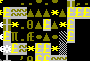
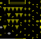

Anyway, I have to re-plan the entrance hall now.

### 28th Opal, 250

The winter was uneventful so far. I prepared the entrance hall, but the drawbridge ist not finished yet. It will probably be finished before spring. Then caravan wagons will have access to our depot, at least if the entrance is not sealed by the bridges.

I fear that I do not have enough rooms for potential immigrants. Enough rooms are dug out, but I do not have enough doors to make proper rooms of them.

Since my term as fortress overseers comes to an end in a month, I need to prepare some notes for my successor.

### 1st Granite, 251

Alas, my turn to oversee this fortress is over. According to tradition, no one must oversee a fortress for more than one year in succession. I will still serve this fortress as manager, bookkeeper and broker. I also have left some notes for my successor.

Notes to my successor
---------------------

### Rooming

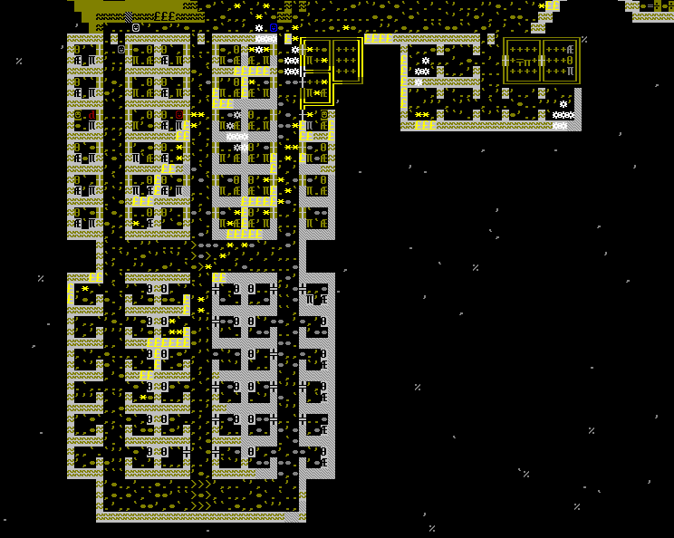

On the map, you can see my bedroom and my office in the east and the other bedrooms in the west. I dug out some extra rooms roughly the same size as mine. They are meant for a potential sherrif, mayors or other dwarves that require more space than others.

In the west, you can see the common bedrooms. Each bedroom has a bed, a cabinet, a coffer and a door. The bedrooms in the northern half are fully equipped, or at least designated to be fully equipped. Right now, we have 36 bedrooms for 19 dwarves.

The southern half is not done yet. None of these rooms are marked as bedroom yet, but several doors and beds are designated to be placed in these rooms. I placed a work order to craft missing furniture, though it make take some time.

In the center, there is a room without a way to get in. Do not open this room! It is the room under a drawbridge, opening this room would make our security concept useless.

### Security

I put some effort in creating a secure entrance to the fortress, but the work is not done yet. The entrance is mostly missing some traps. There are a few things you should know, though.

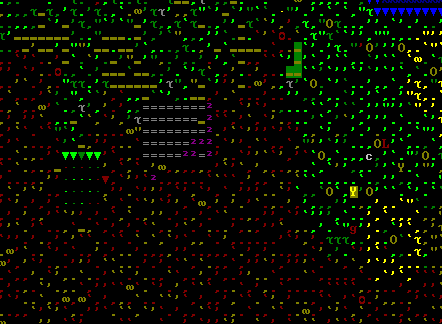

This is the entrance as seen from the outside. It does not look like much. In the west is the entrance. In the east is the pasture for our grazing animals. In the north are the trees that have been cut down by our woodcutter in the beginning of the year. In the center is our refuse stockpile. Sooner or later, we should have some work done on this entrance, but it had no big priority for me.

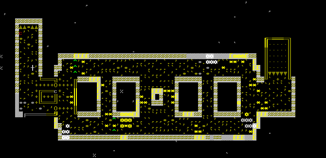

This is the entrance hall. In the west, ramps go upwards to the outside world. In the east, ramps go downwards to the trade depot and the rest of the fortress. In the west, you can also see a drawbridge that can be closed by a lever. In the east, you do not see the retractable bridge above the ramps, because this bridge is retracted right now. When this bridge is unretracted, the entrance is blocked off. This means we have to ways to lock down the fortress, in case an enemy manages to enter the fortress before the first bridge is closed.

In the center, you see the entrance hall. There are already some traps, and I hope there will be more traps later on. Trader wagons require a three-block-wide path to access the trade depot. The strategic placing of the traps forces the wagons to make a detour. An attacker however, will probably charge right in and will get caught in one of the traps.

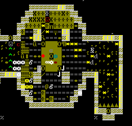

Here we have our trade depot. In the east, ramps go up to the entrance hall. In the west, a hallway leads to the core of the fortress.

Between the ramps and the trade depot, there are two dogs on leashes. The probably won't stop a serious attacker but they will probably buy us some time to mobilize a defense. More importantly, these dogs act as a guard against intruders that try to sneak inside. The traps in the west are just an additional line of defense.

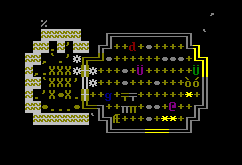

This is our dining hall. I placed the levers that control the bridges in the entrance hall here, because most of the time a dwarf in the dining hall, so in an emergency, we can react quickly. The western lever is connected to the western drawbridge, the eastern lever is connected to the eastern drawbridge. They are also labeled with the same labels as the corresponding bridges. It is basically idiot-proof.

Some general notes on fortress security: When an enemy arrives, keep calm, order everyone inside to a designated panic area and lock the fortress down when everyone is inside. If someone or something does not manage to get inside… well, good luck. Once thing is important though: when designating a panic area, make sure the levers to control the bridge is *inside* this area, otherwise you will not be able to let someone pull the lever.

If the grazing animals managed to get in before the lockdown, good for them. If the fortress is locked down for an extended amount of time, they will starve, however. Consider butchering them for food.

You should probably try to recruit a fighting squad and let them train. You probably don't have any weapons yet, so you should change that as well.

### Industry

So far, we only have a minimal industry going. We have a mason, a carpenter, a stonecrafter and a mechanic. We also have a still and a kitchen and some farm plots.

We have a fisherdwarf who goes fishing and cleans the fishes in the fishery.

### Stocks

Our stockpiles are not very ordered right now. For example, we still have this everything-that-has-no-other-place stockpile around the trade depot.

#### Food & Drinks
We are not in immediate danger of starvation and dehydration, but you should keep an eye on the stock pile level. I tried to breed the chicken but was unsuccessful so far. Maybe the eggs weren't fertilized. Try buying another rooster in case the first one is infertile. If that is the case, you can cook the first one.

#### Stuff for moody dwarves
In case a dwarf enters a strange mood, we have a single copper bar, so good luck if they want more than one bar. We have rocks, rock blocks, cloth, yarn, rough gems, a polished gem and mussel shells. We have no bones for now, but you can always butcher one of the yaks. We have no butcher yet, you should just assign the butcher duty to a random dwarf in that case.

#### rocks
We have plenty of rocks. We have some rough gems, so if you get a gem cutter, cut those gems (but leave some rough gems for moody dwarves). We also have limonite, which is an ore of iron. As far as I recall, we have no magma safe stone yet.

#### metal stuff
We have no forges or smelters yet. We have an anvil and limonite. We have a well-trained furnace operator and a legendary armorsmith.

We have no armor or weapons yet (except for two copper battle axes). We have an unused pick, in case we need another miner.

#### usesless crap
Our Stonecrafter made some rock toys, scepters and other useless crap that you can sell to the elves.

### Further notes
I planned to make the main hall three stories deep. If you like this idea, you can dig it out.
