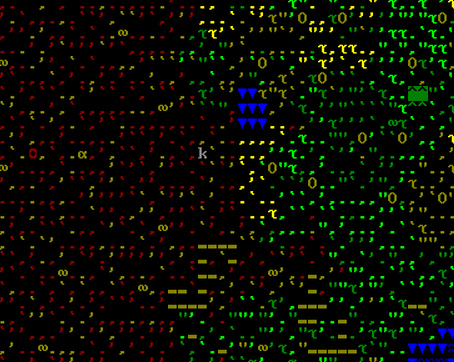
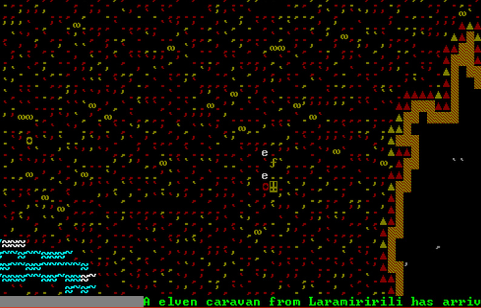
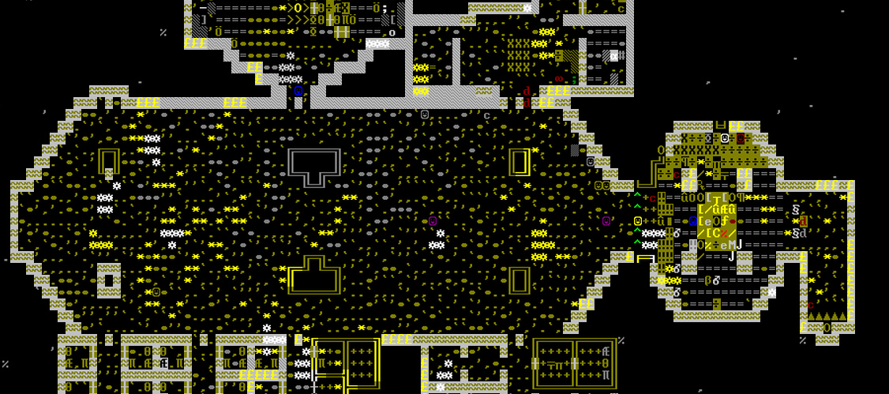

The History of ùkidek
=====================

Year 2 of ùkidek, diary of overseer Rovod 'Gusto' Koganeth
---------------------------------------------------

### 1st Granite 251, Early Spring

New year, new leader. Apparently this is the Dwarven way. Each spring, someone volunteers to lead the fort. This year, I decided to volunteer.

It's not my first time leading a fort, but it has been quit a while. My clan name is Rovod Koganeth, but please, call me Gusto. Mining is my profession, and I'm pretty damn good at it.

I'm pleased to report that our fledgeling fortress looks to be in pretty good shape! Our location is nice and prime, with plenty of deep soil for underground farming, and plenty of timber and other green resources on the surface. Last year we dug out a nice and secure entrance, with plenty of room for caravans that might pass through. Our Inn is already quite popular with the tallfolk, and is regularly filled with bards and adventurers drinking, dancing and singing songs. We've got a nice little outpost going.

I'm a bit rusty at this whole leadership thing, but it seems to me that I just need to continue the projects that are already in progress. I'll expand the farm area to make sure we have plenty of food and drink, and I'll dig out this great hall. The blueprints call for 3 stories. Seems like a good place to start.

2nd Granite, Early Spring:
It's my second day of being a leader, and already my duties begin in earnest. Our thresher spotted a kobold snooping around our entrance. I'm not sure who was more surprised. The thief ran for the hills after being spotted. I hope all our encounters with thieves go this way.

### 13 Granite 251, Early Spring:
Today we finished digging out the first floor of the great hall. We were commemorating the occasion with a keg of fresh Dwarven Ale when a caravan of elves arrived. We showed them our latest work, but they did not seem impressed. Elves. If it doesn't involve a 500 year old tree, the are not interested.

While they weren't impressed with our digging prowress, they did express interest in our rock crafts. I couldn't tell if they were actually impressed with the craftsdwarfsship, or just the novelty of another cultures trinkets. Ironic interest or not, they were willing to trade for them. However, they didn't bring much that I found valuable. I considered buying a full set of wooden elven armor, to use as a punishment. If someone started acting up, I could force them to walk around the mountainhome dressed head to toe in an embarrassing outfit.

After having a nice chuckle to myself, I decided to trade our trinkets and toys for a few bundles of arrows. Say what you will about the treefolk, but their arrows are stout and true.

### 26 granite 251, Early Spring
A group of migrants arrived today just after sundown. We were shaking hands with the first of the weary travelers to arrive, and in the process of breaking open a keg of ale to celebrate, when we heard screams coming from above.

Out of the woods charges an enormous, twisted form of a man. Our festivities are shattered by an ungodly roar that we feel in our bones, even here, beneath the surface.

IT IS A FULL MOON, AND A WEREBEAR IS ATTACKING THE MIGRANTS!

A few of us grab the nearest weapons we can find (is this a *wooden* sword?), and run up the entrance stairs, out into the moonlight.
The grass above is wet with the blood of 3 the migrants, who have have been literally torn to shreds, decorating the entryway to our peaceful outpost like a grim warning.

The beastman moves with unnatural speed. We watch in horror as it rips off the leg of our carpenter, who was out gathering materials. Her axe, which is a better weapon than anything we cary with us now, is no match against the raw strength of the monster. The foul beast turns, still holding the leg in its massive clawed hands. It's bloodlust gaze lands on Iton Ralisbrek, and a small child she is traveling with.

Iton Ralsibrek is a cheese maker by profession, but she is the most experienced fighter among the lot of us. 7 elves have died by her hand, at some time in her past. She locks eyes with the beastman, and steps in front of the 4 year old child. She is standing her ground, unarmed, and unarmored, even as the beastman begins to barrel towards her. I know at this moment, deep in my heart, I *know* that she is doomed. I am about to watch her be ripped apart like a piece of paper

The bear-man collides with Iton like a ton of bricks. They fall to the ground, and I look away. But instead of dwarven screams, I hear another sound. I hear the pained, struggling sounds from the bear. I turn to see the most horrific thing I have ever been grateful to see. The twisted form of the bear-man is un-twisting. The full moon's spell has been broken. The beast has completely left the man, leaving behind an exhausted, bewildered human. Iton takes this advantage.

She carries no weapon, but that fact does nothing to stop her fury. She fights the human with fist and boot alike. The human is trying to escape now. He gets up and starts running away as best he can, but there is a group of us now, and he can not outrun us. If the full moon's spell persisted, he could have slaughtered all of us, but his fate is sealed. We tackle the powerless man. Iton ends his life by ripping his throat out with her hand.

The mother of the small child finds comes running. The child seems relatively unfazed by the events, but the mother is entirely overwhelmed by horror. I can see in her eyes that this day will haunt her for some time.

I check everyone for bite marks, and thankfully find none. It appears that anyone that was scratched or bitten by the monster has died. I will commission some coffins, and make funeral arrangements immediately.

I will also dig out a barracks, and begin training a squad for military service. We were completely unprepared for an attack like this. Our fate can not be left the the whims of the moon.

What a terrible day.
