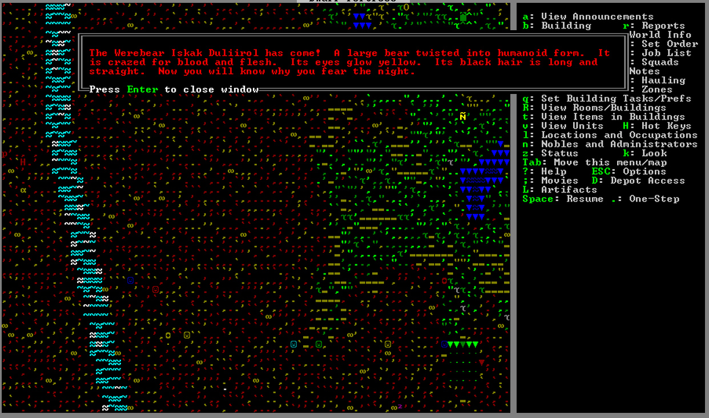
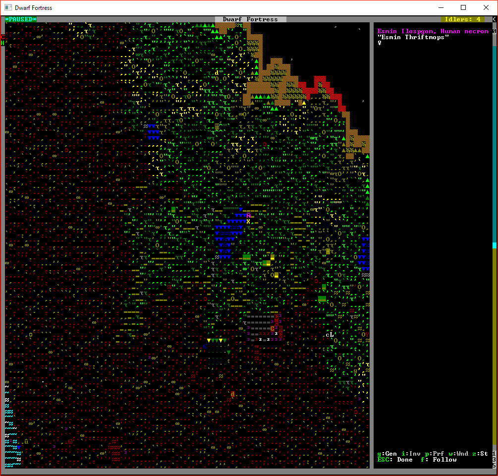

The History of ùkidek
=====================

Year 2 of ùkidek, diary of overseer Rovod 'Gusto' Koganeth
---------------------------------------------------

### 1st Granite 251, Early Spring

New year, new leader. Apparently this is the Dwarven way. Each spring, someone volunteers to lead the fort. This year, I decided to volunteer.

It's not my first time leading a fort, but it has been quit a while. My clan name is Rovod Koganeth, but please, call me Gusto. Mining is my profession, and I'm pretty damn good at it.

I'm pleased to report that our fledgeling fortress looks to be in pretty good shape! Our location is nice and prime, with plenty of deep soil for underground farming, and plenty of timber and other green resources on the surface. Last year we dug out a nice and secure entrance, with plenty of room for caravans that might pass through. Our Inn is already quite popular with the tallfolk, and is regularly filled with bards and adventurers drinking, dancing and singing songs. We've got a nice little outpost going.

I'm a bit rusty at this whole leadership thing, but it seems to me that I just need to continue the projects that are already in progress. I'll expand the farm area to make sure we have plenty of food and drink, and I'll dig out this great hall. The blueprints call for 3 stories. Seems like a good place to start.

2nd Granite, Early Spring:
It's my second day of being a leader, and already my duties begin in earnest. Our thresher spotted a kobold snooping around our entrance. I'm not sure who was more surprised. The thief ran for the hills after being spotted. I hope all our encounters with thieves go this way.

### 13 Granite 251, Early Spring:
Today we finished digging out the first floor of the great hall. We were commemorating the occasion with a keg of fresh Dwarven Ale when a caravan of elves arrived. We showed them our latest work, but they did not seem impressed. Elves. If it doesn't involve a 500 year old tree, the are not interested.

While they weren't impressed with our digging prowress, they did express interest in our rock crafts. I couldn't tell if they were actually impressed with the craftsdwarfsship, or just the novelty of another cultures trinkets. Ironic interest or not, they were willing to trade for them. However, they didn't bring much that I found valuable. I considered buying a full set of wooden elven armor, to use as a punishment. If someone started acting up, I could force them to walk around the mountainhome dressed head to toe in an embarrassing outfit.

After having a nice chuckle to myself, I decided to trade our trinkets and toys for a few bundles of arrows. Say what you will about the treefolk, but their arrows are stout and true.

### 26 granite 251, Early Spring
A group of migrants arrived today just after sundown. We were shaking hands with the first of the weary travelers to arrive, and in the process of breaking open a keg of ale to celebrate, when we heard screams coming from above.

Out of the woods charges an enormous, twisted form of a man. Our festivities are shattered by an ungodly roar that we feel in our bones, even here, beneath the surface.

IT IS A FULL MOON, AND A WEREBEAR IS ATTACKING THE MIGRANTS!

A few of us grab the nearest weapons we can find (is this a *wooden* sword?), and run up the entrance stairs, out into the moonlight.
The grass above is wet with the blood of 3 the migrants, who have have been literally torn to shreds, decorating the entryway to our peaceful outpost like a grim warning.

The beastman moves with unnatural speed. We watch in horror as it rips off the leg of our carpenter, who was out gathering materials. Her axe, which is a better weapon than anything we cary with us now, is no match against the raw strength of the monster. The foul beast turns, still holding the leg in its massive clawed hands. It's bloodlust gaze lands on Iton Ralisbrek, and a small child she is traveling with.

Iton Ralsibrek is a cheese maker by profession, but she is the most experienced fighter among the lot of us. 7 elves have died by her hand, at some time in her past. She locks eyes with the beastman, and steps in front of the 4 year old child. She is standing her ground, unarmed, and unarmored, even as the beastman begins to barrel towards her. I know at this moment, deep in my heart, I *know* that she is doomed. I am about to watch her be ripped apart like a piece of paper

The bear-man collides with Iton like a ton of bricks. They fall to the ground, and I look away. But instead of dwarven screams, I hear another sound. I hear the pained, struggling sounds from the bear. I turn to see the most horrific thing I have ever been grateful to see. The twisted form of the bear-man is un-twisting. The full moon's spell has been broken. The beast has completely left the man, leaving behind an exhausted, bewildered human. Iton takes this advantage.

She carries no weapon, but that fact does nothing to stop her fury. She fights the human with fist and boot alike. The human is trying to escape now. He gets up and starts running away as best he can, but there is a group of us now, and he can not outrun us. If the full moon's spell persisted, he could have slaughtered all of us, but his fate is sealed. We tackle the powerless man. Iton ends his life by ripping his throat out with her hand.

The mother of the small child finds comes running. The child seems relatively unfazed by the events, but the mother is entirely overwhelmed by horror. I can see in her eyes that this day will haunt her for some time.

I check everyone for bite marks, and thankfully find none. It appears that anyone that was scratched or bitten by the monster has died. I will commission some coffins, and make funeral arrangements immediately.

I will also dig out a barracks, and begin training a squad for military service. We were completely unprepared for an attack like this. Our fate can not be left the the whims of the moon.

What a terrible day.

### 29 Granite 251 : Early Spring
We built coffins for our dead to rest in. We dug tomb chambers into the mountain to give them a place of honor beside the living. May we never need to dig more.

### 2nd Hematite 251 : Early Summer
A sharp snapping sound was heard above ground. A curious necromancer had been stalking around our entrance. He is now caged. To be honest, I'm not sure what to do with them yet. We take the cage underground, and reload the trap. These things really work. I'll add a few more traps around. They're low maintenance, and effective.

### 14th Hematite 251 : Early Summer
A human caravan has arrived. Their wide wagons heavy with goods and wares.

The humans seemed to like our mechanisms. I traded quite a few for some food and cheese to spice up the plump helmets that we eat most often. I also purchased some of the weapons they brought with them, but I remain unimpressed. Humans have a keen eye for commerce, but they live their lives short and fast. I've never seen a human weapon that I would bet my life on in a fight that is more than a few decades old. I suppose they don't have the time, or care, to put in the effort to forge the kind of blade your grandchildren's grandchildren will sing songs about.

Mental note to start digging for magma, and light the forges.

As the humans unpack their caravan, one of our engravers is taken by a strange mood. A few days later, he has finished work on Rakescalded, a mudstone bracelet, decorated with jewels and leather. It's a pretty thing, to be sure, but far from the most impressive artifact I've seen. It depicts a human killing an elf. I'm no historian, but this was apparently a big deal back in the day.

### 13th Malachite 251 : Mid-Summer
More migrants. A *LOT* more migrants. Our recruits keep a watchful eye as they stream in to their new home. They still look pretty ragtag. We don't have proper weapons or armor. They look more like peasants with farm tools than an organized military unit.

With the new migrants, we now have more than 50 citizens. I will need to dig out more bedrooms.

### 16th Limestone 251 : Early Autumn

Many hands make light work. With the help of the new migrants, construction of the great hall is complete, with only a couple of construction accidents, and only minor injuries.

An outpost liaison from Atorushat has arrived with a caravan.
We made a new trade agreement, and I bought quite a few basic supplies, as well as a nice steel anvil. With our latest project complete, I think it is time to start digging down into the depths to find magma.

Our Inn brings us a lot of visitors. I can't tell you how nice it is to stop work for the day, and have a drink or three with the company of strangers from strange lands. They seem to enjoy our inn as much as we do. In fact, several of these foreigners have asked to live with us permanently, here in our new home beneath the mountain. I politely declined their requests. With the new migrants, I'm a bit worried about our supplies.

### 7th Sandstone 251 : Mid Autumn
More migrants. Our population is up to 64. I have lost the ability to keep everyone's name in my head, much less their skills and profession. Even my therapist isn't much help these days.

### 3rd Timber 251 : Late autumn
This morning a wee child was possessed by a strange mood, and has crafted a ring. a child! The ring bears an image of a saguro cactus, and two giant langur monkeys. It is very cute.

In fortress news, we have laid out blueprints, and begun constructing a stairway into the great below. We have installed a drawbridge to protect us in the event that we bite off more than we can chew down there.

### 1st Moonstone 251 : Early Winter
Winter has arrived, and with it comes intruders. A handful of Human Necromancers approached from the north. In a hilarious display, one of them stepped directly into a cage trap, and they scatter.

I have created a small jail to hold any prisoners we might capture. The necromancer is down there for now. I still haven't figured out what to do with them.

This incident has brought something to my attention: the body of the werebear infected human is still topside, rotting away into a skeleton. Maybe that is what is attracting the necromancers. I should dispose of it.

### 14th Moonstone 251 : Early Winter
Our miners have cracked open the forgotten underground: The cave system that threads beneath the world. It seems that we don't have any dangerous neighbours down there... yet.

### 14th Opal 251 : Mid winter
I have completed the stair system to the underground. I was sure to seal off the stairwell with walls. No creatures, walking or flying, will be able to make their way into our base. I will leave it to the next leader to explore the underground, and exploit it's resources. You will have to dismantle the wall to gain access. Don't forget the drawbridge, in case something comes up the stairwell.

### 8th Obsidian 251 : Late Winter
I created a garbage chute near the jail. In case we want to dispose of something while underground. It's a simple hole in the ground, with an 8 story drop. Future leaders might consider tossing rotting meat, other clutter, or a goblin, or necromancer down the hole.

### 20th Obsidian 251 : Late Winter
Another resident of the mountainhome has been possessed by inspiration. We certainly are a creative bunch. Maybe we built the fortress on a ley line. A miner claimed the mason workshop, and created a mudstone armor stand. It is decorated with opals and leather, and is absolutely covered with menacinc spikes. It is... interesting to look at, but I would not want it in my room.

Our mayor came to me this afternoon, and notified me, in the self important tone of voice that only nobles can convey, that he has imposed a ban on certain imports. He has been awfully grumpy lately. It was only later that I realized that our mayor, and in fact several other of our noble class, don't have lodgings or offices that befit their status. We should fix this before their demands become... unreasonable.

### 1st Granite 252, Early Spring
Spring has arrived. Time for me to step down, and let the next leader take over.

Fortress seems to be running well, but it still needs work.
The Underground is ready to be explored. It seems to be rich in all kinds of plants and minerals. Maybe there's something useful down there. in any case, digging further down for magma would allow us to start our industry in earnest.
We could also use some more stockpile room. With the great hall built, there is room to expand our workshop areas. We could also use a place for livestock to graze Several animals have died of starvation.
We have two squads of dwarves training in the barracks. I'm not sure they are actually learning anything, but they seem to be trying.
