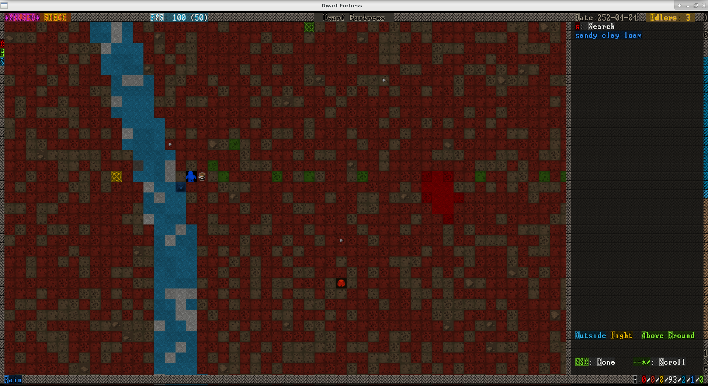

The History of ùkidek
=====================

Year 3 of ùkidek, diary of overseer 'Chance' Egulkûbuk
---------------------------------------------------

### 1st Granite

I stand at the entrance of our fort, the air is humed and warm, even though it's only early spring. Tropical flowers blossom around me, and there are even some ripe fruit on the ground, filling the air with a sweetly scent.

It's disgusting, I cannot fathom what drives the Elves to enjoy it so much. I remind myself that as new overseer of our fort, it is my duty to protect my fellow dwarves from this savagery and continue building a proper home underground. I turn my back on it all for what I hope to be the last time and go back inside, carefully stepping over pools of elephant blood and vomit.

Alas, it was not to be. As I step inside, a group of dwarves is already waiting for me, asking me to save their starving livestock. I grudgingly give my permission to pasture them outside, and move on.

A quick survey reveals that our inn is bursting from the seams with all the human- and elvenfolk we invited in, so I order for it to be enlarged, as well as equipped with a few more chairs.

Following the advice of Grahar, I devise a nefarious plan to put our captured necromancer to work, providing renewable archery targets for our inexperienced troops.

I'm pride myself in my skills with quill and paper, and will try my best to record our efforts in writing and image in the highest detail.

### 5th Felsite

The constructions are moving forward admirably, with some minor hickups. Out of fear what the necromancer might do once he was unleashed, I asked the dwarfs to wall him in completely, with only some fortifications connecting him to the outside world. Mistem Lorokol, good old Mistem, set to work with her famous enthusiasm, but her equally famous intellect got the better of her, and she walled herself in with the necromancer. I had some other dwarfs dig her out, much to her embarassment and the others entertainment. They wouldn't dare to say a word though, since she is generally held in high regard after the creation of Quietmessiah, her artifact.

To save other dwarves from the same fate, I decided to take my chances by locking the necromancer in with a solid door, tightly sealed. We also construct a mechanism not unlike a drawbridge to block his view completely, should that be necessary. I sealed it off from the other side as well, to prevent any of our future archery targets from a premature end under it.

### 3d Hematite

After an uneventful first quarter, on the morning of the 3d Hematite, there was barking at the front door, waking me up. I grabbed my clothes and ran to the entrance ramp as fast as I could, to see what the ruckus was about. Our brave watchdogs had spotted a kobold thief. Upon being discovered, it decided to make a run for it. I certainly couldn't blame it, since our military immediately grabbed their gear and stormed after it.

I assumed they are itching to fight after the terrible werebear attack they were helpless against, and which cost so many of our good dwarves their lives. I tried to caution them against blindly rushing out into the open wilderness, which as everyone knows is full of trees and countless other dangers, but they wouldn't listen. The kobold easily outran them of course. While they were still standing near the river, catching their breath, the alarm blared.

Our scouts had spotted a goblin invasion! Quickly, I shouted and waved to them to make a run for the safety of our entrance, which they did admirably considering their lack of practice and previous exhaustion. Once everyone was inside, I prepared to seal the entrance and block the goblins off for good. As I turn, I spot one of our fishermen still outside. It's Rigòth! The poor fool survived a cave-in when he was young, and is a bit hard of hearing since then. He didn't hear the alarm! We all wave and shout at him to come in, torn between sealing off the fort and running to his rescue, since we don't know the size of the invading force yet. Finally he noticed us and, wondering what all the fuss was about, started to look around. He instantly spotted the goblins, panicked and started running towards us, yelling at us to get ready to close the door.The goblins had noticed us too now, and started charging us. We hesitated for a moment, but then rushed back to the entrance as fast as we could. When we arrived in the relative safety of entry tunnel, we anxiously waited for Rigòth to arrive. He had been quite a bit ahead of the goblins, so we are all sure he would make it.

He didn't. I don't know what happend, maybe he stumbled and fell, but the goblins caught up with him right next to our entrance ramp, and beat him to death without a second thought. We could hear his screams, and even see his blood spattering deep down the ramp. With tears in our eyes, we decided to make the green bastards pay. We wouldn't hide behind our impenetrable defenses and wait for them to go away, we would get revenge for poor Rigòth, no matter the cost. Our captain of the guard, a young and impulsive lad named Sazir grabbed his weapon and was about to attack them head-on, but I held him back. We had lost enough good dwarves today, and our entrance was well defended. So we retreated to the trade depot, and waited for the goblins to make their move. For a while, it was eerily quiet outside. We later found out that the goblins had stopped to methodically slaughter all of our livestock outside, before moving on to what they thought was an easy victory over the cornered dwarves.

Oh, how I would have loved to see their faces when they found out what a terrible mistake they made. Still in a state of euphoria after their kills, they charged in, paying little attention to what was happening around them. They only noticed the traps when five or six of them had already fallen into them. With the majority of their frontline disabled, they backed up as fast as they could when they saw our military advance on them with grim dedication.

We chased them as long as we could, but the little buggers are fast when they put their mind to it, and we didn't catch one of them. I ordered the others to be taken to the newly constructed archery range. The dwarfs were only too happy to oblige, knowing what fate awaited them there. Only Sazir was infuriated. He pushed me aside, muttering something about me being a coward in the face of battle, and how we should have faced them head on, then disappeard. The insolent fool, how did he dare to insult a leader of the fort, who is a hundred years his elder too? I suppressed my anger, reminding me that he was young and witnessed a terrible death today, and retreated to my chambers.

### 19th Hematite

Peace has returned to the fort. After the shock of our loss, we took a while to bury poor Rigòth, but now he rests in peace. Constructions on the archery range as well as the required crossbows and bolts continue. Etur was acting strange today, and claimed a workshop after running up and down the halls babbling nonsense for a while. He's a bard! Against myself, I'm curious what he will craft.

I ordered the construction of some rock pedestals to display it and the other artifacts in our great hall. Also worth mentioning is the attached drawing of our undead archery to be in the upper left.

### 2nd Galena

An elven caravan visited us, trying to sell us a bunch of overpriced, useless treehugger crafts. I passed them by as they were trying to convince Grahar of the benefits of wooden leggings, and secretly asked myself if they wear wooden underpants too. The only noteworthy item they brought was instrument strings made of forgotten beast silk. I doubt they earned it in battle. We bought it, some fruit  and other supplies from them anyway to keep up appearances, and sent them on their way.

### 10th Limestone

Another caravan visited us, humans this time. I don't know what Gusto did to earn their favour last year, but their wagons were practically bursting with goods. They took what felt like a month to unload. I bought what weapons, clothes, food and equipment I could get, offering them a great trade for our gemstones and crafts. I hope they return equally well prepared next year.
Accompanying them was a dwarfen diplomat, bearing good news: Apparently, the reputation of our little forts rapid growth and military prowess has reached the mountainhome, and they offered to make us a barony in our great empire. I accepted, and suggested our founder Grahar as its Baron.

### 18th Limestone

Our preparations are finally done! The archery range is ready, and we have equipped marksdwarves standing by to use it. I had the goblin cages hauled in there, along with a vicious little coati and a strong looking elephant which got caught in our traps. My reasoning was that either the elephant or the goblins would win, the necromancer would turn the losing side into undead, which could then repeat the process until only the undead were left standing. What a terrible miscalculation!

We all gathered in the room, giddy with anticipation. Sazir was standing a little bit apart in the back, leaning against the wall dismissively, and shooting me a cold glance now and then. Seems he is still not happy with how I handle things. No matter! I looked around at each of the dwarves gathered there for dramatic effect, and pulled the lever. The cages instantly fell apart. The goblins and the elephant, who had just been eyeing each other cautiously during our setup instantly went at each other. The coati was trampled immediately, without even getting a single bite into a gobbos ankle. There was blood everywhere, goblins were being thrown around and the elephant let out an ear-splitting trumpet. Like many dwarfs my age, I grew up hearing the legends of boatmurdered, so I didn't really expect to see any goblins left standing when the dust settled. Reality turned out to be quite different though. The goblins had managed to inflict grievous wounds on the elephant, while escaping mostly if not completely unharmed themselves. I was baffled. I had completely stripped them of their armor and weapons before, and couldn't believe my eyes. The elephant was standing in a corner, completely resigned to his fate. It looked like all will or power fight had left him. Three goblins were still hanging from his sides, punching him whenever they could. We continued to watch for a while, but the goblins didn't seem to do any real damage to the elephant then, just punching him with their bare, slackening fists. Embarassed, I turned to the others, looking for any suggestion what to do next, but they just shrugged and decided to leave, deciding that the show was over.

Sazir left too, pointedly bumping into me on his way out. I'll have to have a word with him at some point.

### 1st Sandstone

A wave of migrants reached us. I took them to a tour around the fort. First, we visited the great hall. It looks great now, I put a large part of our unskilled labor to work smoothing it, and we have all our artifacts on display in it as well. I led them to the archery range as well, where the goblins are still punching the elephant, more than two weeks later. They pass out from exhaustion sometimes, but pick up right where they left when they regain consciousness. You have to hand it to the little buggers, they are persistent when they set their mind to something. The elephant is still just standing there like a meaty statue of misery. My marksdwarves still haven't made any serious attempts at shooting them, apart from the occasional stray bolt or two. I think they might still be curious if the elephant will start fighting back and trampling them sometime soon. The dead coati started to smell really badly. Oh well.

### 3rd Sandstone

Today, Gusto was possessed by a strange mood. She's a strong woman, and when she swings her pickaxe, it's a sight to behold indeed. However, she decided to make a boulder almost twice her size the object of her obsession, and It took her almost the whole day to heave it to the workshop. She is a legendary miner, and I am very curious of what she will create.

### 9th Sandstone

ùkidek became a barony! Grahar was appointed baron, as I suggested. I am proud of him, and te mighty talons know he earned it.

Meanwhile, the goblins are still punching the elephant, unfazed by the miasma cloud engulfing them all at this point.

### 17th Sandstone

Gusto has finished her masterpiece. It's a statue depicting the founding of Ukidek, which she artistically underlined with an image of cabbages in emu leather. It reasonates with me as a deeply profound depiction of our surroundings.

The novelty of the elephant-punching goblins has finally run out, and the marksdwarves finally decided to shoot them. Libash drew first blood. He is a kind dwarf, a father, and reportedly a hopeless romantic. When his shot struck the slayer of his dwarfen brother though, it was as if a dam broke somewhere in him, and he loosened bolt after bolt into the group, laughing like a maniac. A few of his friends had to calm him down and drag him from the shooting range. He's a terrible shot though, so the goblins escaped with their lives. Some of them are wounded though, so they have started vomiting in their cell, which certainly doesn't help with the smell. Fortunatenly Sazir is out on business, I can imagine what he would have to say about this.

### 23th Sandstone

Our mayour demands we build warhammers, and I tend to agree with him. We need to proceed with our exploration of the depths, to unearth a magma vein to power our furnaces. I am worried though, I am a man of books and not comfortable facing the horrors that might lurk within the caverns. In the meantime, I settle on providing better quarters for him and our other nobles for now, Grahar among them.

### 26th Sandstone

The Hillocks of Dawnsacks have been founded, and made part of our holdings. I can't believe how far we've come in only three years. The goblins are still alive, most of them considerably wounded by now, vomiting all over their cell, and passing out in it. If I ever get killed in battle, I hope that it is by a skilled Marksman.

### 26th Timber

Another Hillock has joined our barony. Rumour of our prowess seems to inspire dwarfes all around us.

Meanwhile, the goblins are still alive and have started screaming without pause. The archery range looks, smells and feels like a vivid depiction of the underworld and its torments by now.

### 10th Moonstone

Our fortress has become an entertainment capital. I briefly wondered if it was because of the goblins, who are still alive, even though our marksdwarves have been shooting them all this time. I especially suspect Libash of sneaking there at night and doing unspeakable things to them. They are our sworn enemies, and pure evil all the way down to their rotten core, but I begin to think that nobody deserves what they are going through. One of them has gone berserk, and runs around in circles in addition to screaming constantly when he's awake.
The tourists however seem to be preferring our tavern. I have been so occupied with other matters that I granted every request to perform there, and now we have veritable horde of bards living with us. Just now, a crocodile man poet passed me on the way to his performance. What strange times we live in.

### 16th Moonstone

Today, a bloodcurdling scream interrupted my sparring session. We grabbed our weapons and ran to locate the source, only to find a quivering bundle of nerves at the top of the stairs to the underworld. He told us that he had been looking for gems down there, when he heard something heavy hissing and scratching below. He found a crack in the walls, and through it observed a terrible beast. Some cruelty of nature twisted what used to be a pretty, yellow bird into a bloated, blind monstrosity, spewing poison spittle from its swinging trunk. I prayed to the mighty talons that Gusto sealed our entrances tight. I sent a dwarf to look for the lever to raise the bridge, but he returned empty handed. Panicked, I sent him to install one right here, right now. He did it, and we waited for the beast to come for us, weapons drawn. A few breathless hours later, it became clear to us that Gusto hid the entrance well, and we were indeed safe for the time being. A brave spotter dwarf volunteered to check, but couldn't find a trace of it. Has it disappeared? Our soldiers have already given it a name: Ngalák. I hope we don't see it again.

### 26th Moonstone

The beast hasn't been spotted since its first appearance, and the fortress has returned to its normal mode of operation. The Hillocks of Helmedhour were founded, but with the beast still out there, I find it hard to celebrate.

### 16th Opal

The beast is back! One of our miners heard noises, and witnessed the beast fighting a giant cave toad. Toads are a foe to be reckoned with, and have been the undoing of many a careless dwarf, but the monster ripped it apart without even breaking a sweat. It hit the toad with its spittle, and then grabbed it and ripped it open over its full length. A gruesome sight indeed. I am once again thankful that all access to our fort has been walled up so carefully. With renewed confidence in our defenses, I ordered our dwarves to continue digging to further depths in order to finally find magma.

### 20th Opal

Today it was Lorbam's turn to be struck by inspiration. Thankfully he as well found everything he needed, and locked himself in a workshop, a manic shimmer in his eyes. Personally, I am more taken by the work of Alath, who cooks masterpiece after masterpiece for us.
Meanwhile, we struck marble in the depths, which I am sure will come in handy if we want to produce more statues for our increasingly demanding nobles. Aban, our other baron, has taken up making bolts as a hobby. He is terrible at it, but the other dwarfes indulge him. At least this way, he's occupied. I wasn't inclined to believe rumours about certain mental disabilities in his bloodline, but he frequently stops making bolts, loudly demaning more logs, even when he is literally sitting in them. That's nobility for you, I guess.

### 8th Obsidian

It finally happened. During training, Sazir made another snide remark. This had been going on for a while, so I snapped, and charged him into a wall. That turned out to be a terrible mistake, as it gave him the excuse he needed to finally vent his long kept anger. He turned on me like a wild animal, all semblance of self control completely gone. He clawed at my face, and tore my nose clean off! I watched it fly away slowly, as if I was in a dream, far removed from the scene. While I was still stunned and in agony, he landed a few more hard punches, and destroyed my hand in the process. I don't think he will be punished for this, since while I have been leading the fort all this time, I don't hold an official rank, while he is still captain of the guard. Everyone expected me to be enraged and try to go after him with all means at my disposal, but strangely enough I feel nothing. I just hope that he will regain his composure and be able to return to a normal life after his traumatic experiences which culminated in this violent outburst.

### 14th Obsidian

We reached a new layer of caverns, directly below us. Fortunately, none of our experienced miners fell into the resulting hole in the ground. I ordered them to close it immediately, still wary of the forgotten beast above. While walling it up, they open another hole when building the extra stair back up, but after some additional artisanal failures, I am now quite confident that the entrance is sealed again.

Lorbam emerged from his workshop, presenting the bracelet he made. It depicts Rigòth, our child prodigy, not poor departed Rigòth, when inspiration struck her. Seems that Gusto wasn't the only one deeply impressed by her genius.

### 18th Obsidian

Looking over our fort, I see happiness and potential, but also many traumatized dwarfs who are still trying to cope with what they saw. For many of them, the events still seem to be vivid in their minds. I wonder if there is a more recent reason for their terror that I missed while I was injured. Apparently our records show an alarmingly high number of dead bards, one of them our artifact creator, but I decide to leave such gloomy investigations to my successor. Whoever he or she is, they will have their work cut out for them. Ngalák is still out there. The goblins, needless to say, are still alive. The elephant has succumbed to its wounds in the meantime, but the necromancer has made no effort to revive it. Maybe she's not a necromancer at all, just a show-off with a poor sense of fashion? That would explain why she stumbled into our traps so easily. We also still don't have access to a proper source of magma for our forges, and there was a worrying number of brewing and cooking cancellations recently. I hope that over the past events, I didn't neglect something important, and wish the next leader of the fort a more fortunate outcome of their reign than what I endured.
