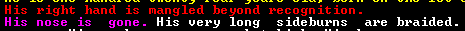
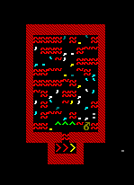

The History of ùkidek
=====================

Year 4 of ùkidek, diary of baron Grahar Vabôktad
------------------------------------------------

### 1st Granite, 253

I've been thinking. Now that I am a baron, I will probably never get to found a peaceful, prosperous fortress in the middle of nowhere. I'm stuck here, threatened by necromancers and the ever advancing threat of the war front. Well, there is an old proverb in the Unions of Bath, our allied human civilization: ”When life gives you muck roots, make swamp whiskey.“

If I want to have a good life here, we need three things:
- outer security, which includes trained and equipped fighters
- inner security, which includes happy dwarves and a working legal system
- prosperity

Unfortunately, I am not the overseer and only have limited power right now. So I better

I was just interrupted by one of our peasants. I can't remember her name (it's probably Urist or something like that). She told me they don't have any volunteers for a new overseer, so I have to take over the job. Perfect!

#### Addition

I spent most of today to get up to date on what is going on in the fortress. For the last two years, I mostly relayed work orders and took inventory, so I was not really up to whatever important stuff was going on.

#### nobility and holdings

Most importantly, I found out that I am not the only baron in ùkidek. Aban Momuzdeduk, the baron of Machineflashed and his wife reside here as well. Machineflashed is apparently a medium-sized hillocks. Aban migrated to ùkidek before he became baron. When his father died last summer, he was the replacement. I asked him he wanted to return to Machineflashed. He doesn't. He said he never lived in Machineflashed, and neither did his father.

Aban also told me that barons have the right to have much nicer rooms than both of us have today.

Oh, did I mention that Aban has a bedroom fit for a king? He has this legendary armor stand is his bedroom. Unbelievable! I am *the* baron of Dinnerbrains. He ist just a baron of some unimportant Hillocks he doesn't even care for.

Alåth the mayor also complained about his dining room. We need some larger rooms with high-value furniture. The current situation is unbearable.

#### Happiness

After the Sazir incident last year, it became evident that our dwarves need a way to relieve stress. We currenlty have no assigned performer in our inn. Our inn is also to small, I get complains about crowded tables.

All the animal skeletons left outside are also a problem. Some of them are even the remains of pets, which is a bit traumatizing for some of our weaker minded. Not to mention that having half a dozen skeletons lying outside is a considerable threat, given that we have already been attacked by necromancers twice.

There are several Workshops outside, which means dwarves have to work outside. **Outside!** No wonder everyone here is traumatized. Even the children play outside!

We also have only one kind of booze and are quickly running out of it.

Our biggest morality problem however is that we don't have a place to pray. This needs to be changed quickly.

So, four steps do be done:
1. create a temple for everyone who wants to worship any kind of god.
2. create three temples for the most worshipped gods in our fortress
3. clean up the outside, move the workshops inside
4. produce a larger variety of brewable crops
5. dig another, larger dining hall in addition to the existing one

#### Security

As mentioned before, childs play outside, dwarves work outside. The outside is covered in animal skeletons just waiting for a necromancer to appear.

Our melee militia is completely unequipped and untrained. Our only qualified carpenter is part of the militia. We need her, we cannot affort to lose her.

The fortress guard on the other hand is at least equipped with leather armor (well, as far as we have leather armor) and weapons. On the other hand, some of our most skilled Stoneworkers are part of the fortress guard! Also, the captain of the guard keeps complaining about having no prison for criminals. We have no prison. We need to dig out some room for one.

At least our marksdwarves are equipped and training. The zombie-shooting-range is still not working, but we can fix that.

Regarding the weapons and other equipment, we need a forge first. However, we have not struck magma yet. We need to dig deeper. And there is a rumour about a monster in the first cavern layer. After investigating these rumours, I got the following description:

”How do you know its appearance?“ I asked the bard who told me about it. Have you seen it? ”Of course not“, he answered, ”Overseer Gusto walled of this whole cavern. That was before the beast appeared“.

”Then how do you know how it looks like?“ He shrugged. ”Experienced miners can feel the vibration of the rock and can tell the shape of monsters.“

Maybe I shouldn't have asked. However, until our militia is better trained and equipped, I will not open the cavern again. Better safe than sorry.

#### Prosperity

We need more space to produce stuff and store the raw materials. Most importantly, we need to get to the magma sea to build smelters and forges. A pottery and a glas furnace may also help to produce high-value trade goods and furniture.

As mentioned before, we also need a larger variety of booze. And more booze. We only have 41 servings left, with a fortress population of 137 (including resident performers, but not including short-time visitors). At this rate, we will be dry by the end of the month. We also have a gigantic plump helmet field and over six hundred plump helmets. We should replace this with several smaller but more diverse farm plots.

We also have lots of mussel shells lying around. Maybe we can craft some trinkets with them. I don't want to imagine what those necromancers will do if they raise over a hundred mussel shells at the same time. This is scary.

So, long story short:
1. dig to the lava sea
2. build forges and smelters
3. optimize booze production
4. replace the plump helmet plot with a more diverse field
5. Make shell crafts
6. start a pottery and glassmaking industry

#### Dead Bards

After reorganizing some labours (especially reducing the number of our fisherdwarves to one), the peasant was at my door againm asking me what to do with the dead bards. Apparently, some bards dropped dead, dying of old age. I told her to just bury them, but she told me there weren't any empty graves left. She knows more about what's going on in this fortress than me. Maybe I should make her my assistant.

I just sent her away, with a production order for more coffins when the shouting started.

I ordered everyone inside. On their flight, our people counted some more intruders. Necromancers! Just as I feared. But before they got to raise our killed livestock, they fled.

Not a moment to soon, it seemed:

The Gates close with a loud **THUNK**. One of the last people to get in was the elven diplomat, scolding me about cutting trees. As if I had no other problems. What a day.

### 4st Granite, 253

From various reports I gathered an approximate number of enemies:

- 25 goblin soldiers, riding on
- 25 beak dogs
- 10 trolls
- 14 elves, part of the performance troupe ”The Calm Cacti“ (or maybe they just have a bad timing).

Right now, we can hear the agonizing sound of our livestock and pets being killed. Why were the pigs outside anyways? They don't even need the grass!. I order our miners to dig an underground pasture for the next time some goblins arrive.

Oh, and I also orderd Lolor's bedroom to be walled off. It still had a hole in the ceiling, leading outside. The problem with the workshops outside solved itself, by the way. The trolls destroyed them.

### 7th Granite, 253

It has become silent outside. What are they planning to do?

### 10th Granite, 253

We are almost out of booze, and since our only water supply is outside, we need to see if the goblins actually left.

### 11th Granite, 253

Outside is a stinking hell of rotting cadavers. The goblins killed all of our livestock that was outside, a wild elephant and some visiting human fighters. All in all, they only lost three trolls to traps. I don't know why they are gone. The elven performance troupe was not attacked.

On the plus side, we opened the gates just in time for the elven caravan to arrive. Most of their goods are useless, but right now we need booze. They also may have some useful trained animals. We need to replace our killed livestock.

Oh, and apparently, we have no crafts to sale. I ordered our stonecrafter to make some for the humans in the summer. For now, I will just sell prepared meals.

### 15th Granite, 253

The elves brought a frickin' grizzly bear! If they bring another one next year, we may even be able to breed them!. I also bought some fruit to have some variety in booze. I got this all for one pot of prepared meals. I even bought some wood from them because it was cheap and we may need to make charcoal to produce steel in the future.

### 16th Granite, 253

The new burial cave is dug out, the coffins are placed as I write this. They are below our living quarters. This is also where I will place our temples. Oh, did I mention we have no hospital yet? I recently replaced our chief medical dwarf with someone more experienced, but that does not help if there is no hospital.

### 23rd Granite, 253

Some migrants have arrived. I will sort them out later.

Ingish created a masterful statue of Lêgan, the god of truth. This will be the centerpiece of our new general temple. I also plan to create a temple for Ekurkidet, the goddess of suicide, death, war and fortresses. I think we need this temple.

The booze supply is still critically low, but we still manage to produce enough to not be totally dry. Oh, and we have cherry wine now. Alåth wanted to use it for her new roast recipe, but I prevented that.

### 24th Granite, 253

Whoa. We have about fourty immigrants. Some cattle and a donkey foal (which I immediatly placed on the new underground pasture), many children and some dwarves with weapon skills. A high master brewer (right on time), an adequate Blacksmith (better than nothing), two master mechanics and a great woodworker. All in all some great additions to the fortress. We need more rooms, though.

### 2nd Slate, 253

We make progress on many fronts. I have breached the second layer cavern again and ordered stairs to be built downwards. When that is done, I will wall the stairs off.

The main temple makes progress, the statue is about to be placed. We still need doors, though.

We enlarged the workshop area. I also ordered new baracks do be dug out, since we need the old baracks for workshops. I put the new baracks close to the entrance hall, so the militia can act quickly against an outside threat. We also have another melee squad. I intend to build baracks for them somewhere close to the cavern shaft, so they can act quickly against beasts from the cavern.

I just don't have the capacity to enlarge our inn now. But it is very crowded. See for yourself.

### 8th Slate, 253

Today I asked one of our resident animal trainers if they can train those caged dogs for war. Turned out those aren't dogs. They are dingoes. We can train them to not attack dwarves and livestock, but they will never be a war dog that is true to its master. Well, maybe we can breed them for meat.

### 9th Slate, 253

We breached the third cavern layer. And it's got a magma pool. This means we don't have to dig down all the way.

And even better! Gusto told me they found adamantine in that cavern! This is stuff of legends! I will wait before mining it though. It is only worth to be processed by the most legendary smiths.

### 11th Slate, 253

I don't want to dig further down before we sealed of the caverns. Instead, I orderd some new rooms to be dug out.

### 12th Slate, 253

The main temple has been opened today. It still needs some smoothing, but we finally have a place to pray at.

### 2nd Felsite, 253

The miners have finished digging out the new rooms, so I can finally move on to get appropriate rooming. I also designated some rooms for the baron of Machineflashed. I designated them to be dug out west of the great hall.

I roughly plan to dig even more elaborate rooms on the layer below, in case the king ever decides to pay us a visit. That reminds me. I have some notes laying around here, some even from the visit of the outpost liaison in 250. Back then I was to busy to read them. I handed them over to my successor. The seal is still intact, though. Meh, can't be that important. I'll just read them tomorrow.

### 3rd Felsite, 253

Holy Lêgan!

> The king is dead, long live the queen!

I should *really* read those memos on time. King Fikodkadôl was killed in an elven attack in the early summer of 250, only three months after he sent me to found Dinnerbrains. His eldest daughter, Bëmbul Boatsholy became queen after him.

The king was twenty years younger than me. I am suddenly very happy that I am not in Bridgehill anymore.

### 9th Felsite, 253

The garbage drop that Gusto installed is finally in working order.

The garbage is on a floor hatch that can be opened with a lever. The garbage is dropped several stories. In the future, I would like to move it a few tiles to the east, so we can drop our garbage into the magma pool. For now, we just let it drop into an unused hole.

Here is how to empty it:
1. Make sure no one is in the garbage drop room
2. Lock the door to the garbage drop room
3. Pull the lever besides the garbage drop room twice
4. Unlock the door

I also marked the skeletons outside to be dumped. Less fooder for necromancers. 

### 15th Felsite, 253

The second and third cavern layers are now completely separated from our staircase. As soon as the miners finished digging out the noble quarters, we can start designing the smelter and forge area.

Our booze stock has been quadrupled since the start of the year. We now have about 160 servings of booze, which is not much, but we are on the right way. We also have more different kind of drinks, which is a nice change.

### 16th Felsite, 253

Aban, the baron of Machineflashed mandated the construction of two animal traps. What the hell do we need animal traps for? Catching vermin? They are completely useless. And I bet we can't even sell them, because he will impose an export ban on them once they are made.

### 25 Felsite, 253

I was just writing some work orders to get some magma safe flood gates, mechanisms and stone blocks made, when Chance, the previous Overseer, dropped in. By Lêgan, he looked horrible. Since we are lacking a hospital, his right hand has not healed correct. The nose is a lost case anyways. I assumed he wanted to talk to me about opening a hospital, but instead he told me about his idea for a pump stack to pump magma to one of the upper layers, so we don't have to walk deep down for our forges and smelters.

An intriguing thought. I called our engineers and asked for their opinions. They seemed happy about it. Called it a really cool project which they really want to do.

My usual translation from engineer-talk like this is: It is dangerous, costs more than it benefits, will take forever and will probably fail spectacularly and kill us all. I decided to postpone this experiment indefinitely.

### 28th Felsite, 253

While the stone detailers are busy smoothing my quarters, the miners are busy digging out more rooms and a hospital and the engineers are busy figuring out how to safely provide the forges with magma, I decided to put an end to the captured goblins. The original concept of using them as undead archery targets never really worked out. And now they have literally gone mad.

Two of them are running around with foam coming out of their mouths, willing to attack anyone without any thought of self perservation. One runs around babbling, completely out of his mind. Another one is stricken by melancholy and does not do anything anymore. Only one of them seems to somewhat same, but is throwing an tantrum right now.

### 1st Hematite, 253

The fight was short and gory. Our soldiers entered the room and made short work of this mess of former goblin soldiers. The necromancer did not try anything. Chance suspected he was unable to properly see them through two rows of fortifications. I plan to re-cage the necromancer later so we can make some other experiments with undead as archery targets later.

### 9th Hematite, 253

èzum Taddumat, a fish dissector withdrawed from society today. He is a novice stone detailer and a novice blacksmith. While I hope he will go in the blacksmith direction, he will probably try something with stones, since we have not forges yet. And no metal bars, besides one gold bar which we bought from a caravan.

### 10th Hematite, 253

A human caravan from Gil Bepa has arrived. Let's see what those long people brought us. I hope we have enough stone crafts now, so we don't need to sell any more food.

I am kind of busy because I am sorting my list of what we can sell, but… why do we have a barrel of cougar blood? Apparently, I bought it. I need to drink more alcohol. Being sober makes me stupid.

Oh, an èzum has claimed a craftsdwarf's workshop. The mussel one reserved for bone carving. I guess we won't get more mussel shell decorations before he finished whatever he is up to.

### 11th Hematite, 253

A human diplomat has arrived as well. It is Okgush Rinlasod, their law-giver as well. Still, he has to wait until I finished trading.

Oh, and the hospital has been dug out. I will add a sketch of it here once the furniture has been placed.

### 14th Hematite, 253

Okgush convinced me to meet him right away. He mostly talked about the war they have the Familial Wisps, the elves that are still friendly to us and sold us the grizzly bear earlier this year. The rest was small talk. It was a bit embarassing that we had to meet in my old office, but my new throne room is not furnished yet. But now… let's go shopping.

### 15th Hemamtite, 253

I bought some common and precious cut gems, some bars of metal of different kinds, some alcoholic beverages (we are still low on alcohol). I decided to not buy more animals, because our underground pastures are rather small at this time.

I also bought many bins of cloth and leather. We do not produce cloth at all and leather only in an insignificant amount. We may need it though. If I want to get a glass industry running, we need to collect sand in bags. The few bags we have are not even sufficient for our threshers to but our quarry bush leaves in.

We are now out of stone crafts and had to throw in a few barrels of prepared meals as well. However, once we have a potter and a glasmaker, we will have more than enough useless crap to sell.

Oh, and the hospital is furnished. The walls are still rough, but we will fix this in time. For now, are least Chance's hand can be treated. His dedication to duty is admirable. If my hand was crushed when I was an overseer, the first thing I would have done is to mandate the construction of a hospital. He ran around with this gruesome wound for several months.

Let's just hope the unsanitary conditions in the hospital won't give him an infection. Right now, we don't even have soap.

### 16th Hematite, 253

I bought some thread from the humans after Rigòth, our chief medical dwarf complained that he can't suture Chance's wound without thread. I also bought some cheese and some plants so we can replace the food we sold to the humans.

èmuz has not started working yet. He scribbles the pictures of rough gems, skeletons, a quarry, leather and cloth on the walls of the workshop. I guess he still needs material. We have all of that material except bones. Maybe I can get a butcher to disassemble the elephant skeleton that the goblins left outside. If not, we need to slaughter one of our other animals.

### 18th Hematite, 253

I ordered a boar to be slaughtered.

### 20th Hematite, 253

Chance's hand wound has been sutured and dressed. Unfortunately, his hand was infected. I hope he will pull through. In any case, we need some soap. Once the forges ar build, I will put a side focus to soap production. For the record, here is the report from our chief medical dwarf about Chance's wounds:

### 21st Hematite, 253

Since I'm trying to build a sealable entrance to the third cavern layer to breach the magma pool and supply our forges with magma, our miners are only working some of their time. To better use their abilities, I let them start digging out some rooms for a potential royal visit.

In contrast to my original plans, I did not designate the royal quarters below my quarters. Instead, I am building them in the marble layers. This has two advantages:
1. the royal quarters are made of marble and therefore worth more than our mudstone quarters
2. we need marble anyways, since we can use it as flux material for steel production

### 24th Hematite

èzum Taddumat has started working on his big project. The materials he has are mudstone, two jet rocks, yak cow bone, giant cave spider silk, boar bone, harlequin opals, cat leather, more harlequin opals and koala leather. I' curious.

### 25th Hematite, 253

Oh carp. It seems we have a vampire among us. When Kadol did not appeared to work today, someone looked in his room and found him drained of blood. Kadol was a good friend of mine, one of guys I brought along when I was sent to found this fortress. Even worse, he was our only architect. How can we build our security bridges without him?

We have to find the vampire and bring them to justice. Unfortunately, we don't even have a jail yet.

I appointed Likot, another Mechanic to be our new architect. Better than nothing.

### 28th Hematite, 253

èzum finished his artifact:

He claimed it as family heirloom, but he will probably accept if we display this work in a temple of Nanir (once we have one).

Still no clue who the vampire is.

### 9th Malachite, 253

A migrant has arrived. A single one. But he is a high master suturer and wound dresser and most importantly: an architect.

### 13th Malachite, 253

Our booze stock is shrinking again. I decided to streamline the process. Right now, we don't have a dedicated stockpile for ra materials for cooking or brewing. I will change that. I will also set up a stockpile for empty pots and barrels, as well as a larder for prepared meals and beverages.

### 14th Malachite, 253

Our first batch 30 portions of charcoal has been finished. I will set up an order to produce charcoal whenever we have less than 60 units of refined fuel and at least 60 wood logs.

I also ordered to make some ash, the first step to make soap.

### 17th Malachite, 253

The bridge to lock off the third cavern layer has been built. It is a retracting bridge that blocks the cavern if the bridge is not retracted. It will be connected to a lever in the north-west of our dining hall.

### 23rd Malachite, 253

I designated tombs for Gusto and Chance. Former overseers deserve a dedicated burial place. I also ordered the construction of some marble statues of all former and present overseers.

### 27th Malachite, 253

My new quarters are finally furnitured and smoothed. So are Aban's quarters. He still wants those animal traps to be made though. He shouldn't even have the right to mandate productions. Anyways, our carpenter has neglected to make the animal traps so far.

### 6th Galena, 253

We breached the third cavern layer for the second time. I ordered the militia to watch out for threats. There are some interesting-looking giant fungi down there. I ordered some of them to be cut down. Better than this boring above-ground wood.

The next steps are to build some walls to direct the magma to where we want it and channel into the wall of the magma pool.

### 17th Galena, 253

The blood of the earth is flowing. Before I flood the tubes below our forges, here are some schematics how the tubes work:

There are two floodgates to the magma tubes. The one in the east is for flooding the magma tubes, the one in the west is for draining them. In the layer above are the forges. North and south of the staircase are labelled levers to controll those floodgates.

Thats enough talking. Let the magma flow!

### 21st Galena, 253

The magma is slowly flowing through the tubes. Soon we can start a proper metal industry.

Oh, and we caught some elk birds in the third cavern layer. Maybe we can train and breed them.

### 27th Galena, 253

The magma forges and smelters are now supplied with magma. Right now, we only have one furnace operator, so I told one recently grown up peasant to learn furnace operating. Another recently grown up peasant gets to become the our weapon smith. If we have to train a weapon smith, we may as well train someone who has a lot time to live.

### 4th Limestone, 253

While waiting for the metal industry to take off, I started preparing some stuff for our glass and ceramics production. I dug out two rooms to collect sand and clay, another room for the workshops with the tools for collection and a new area for leather and cloth processing. I already ordered to make some bags for collecting sand.

Now I only need a potter and a glassmaker. I already have someone in mind as potter, but for glassmaking… well, where is my list of citizens? Eeny, meeny, miny, moe…

### 5th Limestone, 253

I ordered some copper bolts to be made. Good training for our dabbling weaponsmith.

### 10th Limestone, 253

I cancelled the production order for the animal traps. It just blocked the carpentry. Maybe our carpenter can now _finally_ make some bins. The metal production is running, and we really need some bins for the metal bars. And for other things.

Maybe I someone can make metal animal traps.

### 12th Limestone, 253

The outpost liaison and the caravan from the mountainhomes have arrived. Again I have to both have a meeting and trade at the depot at the same time. Maybe I should promote my assistant to the position of the broker.

The caravan comes from the north, which means the have to navigate though the forest. I am thinking of building a road. Any self-respecting fortress should have a safe road up to their gates.

I just hope we have enough stone crafts since neither our pottery nor out glass industry has started yet. Due to the problem with our carpenter that I mentioned before, we even ran out of cages.

### 15th Limestone, 253

Stukos Dorengatiz is throwing a tantrum. Great work, Stukos, embarassing me in front of the outpost liaison.

Now she destroyed a cage trap. Thank you for destroying our fortress' defenses!

### 17th Limestone, 253

I made my assistant the new fortress broker. ”Urist“, I said, ”I have an important meeting with the outpost liaison. I hereby declare you to be our new broker.“ Her answer was that she was not named Urist.

Anyways, she made some good deals at the depot, bought lots of alcoholic beverages, leather and cloth, as well as some metals that are rare around here and some precious gems.

### 22nd Limestome, 253

News from the outpost liaison. Some rumours about the war, and I will be recommended to be a count. I ordered some precious gems, drinks (in case our production continues to stay low), some rare types of leather, silk and some ores that we have not found here yet, and coal.

On the other hand, they offer us higher prices for several goods, but most importantly amulets and crowns, which we can produce en masse.

After the meeting we made a short tour through the fortress, where I demonstrated our progress. That is where she dropped the bronze colossus: ”Oh, by the way: the queen may or may not visit you next year. You better have some quarters prepared for her.“ Great.

### 24th Limestone, 253

I added another romm to our inn. Here is a sketch, just before it is fully smoothed out and filled with people:

### 27th Limestone, 253

The vampire has struck again.

This time however, the vampire was not really smart. Due to lack of rentable rooms in our inn, the poet slept on the floor of the inn. The inn that is overcrowded all the time. That was where the vampire attacked.

Tosid Ensebgusil, militia captain of a squad that contains only one fighter (after the other one became a legendary stone detailer due to a mood). Now we have a problem. We have no jail. Sazir, the captain of the guard constantly reminds me of it and is quite frustrated right now.

I ordered some chains to be made, but neither the chains nor the frickin' animal traps have been forged so far. We also need a jail for a few days of jail time for Stukos who vandalized a trap earlier. Do we still have ropes? Maybe we can use ropes instead of chains for now.

Update: we have no ropes. An iron chain however is forged just as we speak. Mebzuth, the metalcrafter in training is just a bit confused by the bards who just made a polonaise through our smelters:

### 4th Sandstone, 253

I cancelled the animal trap work order. Apparently, no one besides the baron of Machineflashed wants any animal traps. Anyone who is capable of making one does not want to make them. We soon have a prison, then Aban can imprison anyone for not making two animal traps. See if I care!

### 6th Sandstone, 253
The murder of Etur Sodelukosh has no less than 77 witnesses, all pointing to Tosid. I think that is enough to throw her into jail, and I can be reasonably sure that she also killed my friend Kadol.

### 10th Sandstone, 253

Tosid got over four hundred days of prison sentence. This means that it is up to my successor to decide what to do with her once she gets free. I suggest ordering a raid on the necromancer's tower. I heard zombies don't attack vampires. Maybe we can steal some of the necromancer's books.

### 11th Sandstone, 253

Tosid is in prison now. I locked the door as extra security measure. Once her sentenced is served, my successor should unlock the door again.

I also made a sketch of the prison area:

### 14th Sandstone, 253

Aban Momuzdeduk's work order for animal traps ended up unfinished. Aban reacted to this by throwing Lolor Avuzdeler, our legendary Stonecrafter, into jail for 51 days. You know, the one who makes all of our trading stuff? Who only works with rocks and has no experience in making things (like animal traps) with wood or metals. Aban is becoming a serious pain in the ass.

### 18th Sandstone, 253

The Sand and clay collecting has begun. We now have two regular kilns and two regular glass furnaces for the sole purpose of collecting raw material for our potter and our glass maker. The rooms above are for collecting clay and sand.

But… how to make sure we always have access to the sand and the clay? The vegetation grows rather fast. Then inspiration struck: We have elephants and elk birds. Those need to graze. If we train them and let them graze in the sand and clay rooms, they keep the vegetation down. That way we can kill two birds with one stone.

À propos killing birds: I will order some armor soon. Our soldiers trained the whole year. Since we had no other weapons, most of them are now axe fighters that fight with the axes we have for cutting wood. I will build a sealable entrance to cave layer one, where we can finally kill that forgotten beast. This project should be done by winter.

### 1st Timber, 253

I set up some traps and re-caged the necromancer. I don't know if I can rebuild the undead-training program but if not, my successor may do it.

### 3rd Timber, 253

Our fighters have been underground for several years now. This may be a problem when we face an outside threat. The solution: The Burials of Laboring, our melee squad now guards the entrance every second month. The other time, they are scheduled to train.

They have been outside for two days now, and the cave adaption sickness has kicked in. I'm pretty sure they all hate me now, but they will thank me later.

I also started the street project and set up some walls around our entrance. This is the first step to a representable building as entrance, not just the hole in the ground we have now.

We also have a new holding. One step further on my way to be a duke.

### 13th Timber, 253

Monom Stinthäddeleth, our twelve-year-old weaponssmith is learning fast. She is still only an adequate weaponsmith, but she already managed to make to exceptional copper bolts. Most of her work so far is well or even finely crafted. I decided to let her try to make some weapons. I ordered five of every kind of spears, battle axes, short swords, maces and war hammers. Our current equipment is mostly of regular quality (if we have weapons of that kind at all), so having some well-crafted weapons is definitely a step up.

I don't let her use steel yet (we don't have much steel yet, so what we have is given to our legendary armorsmith to make exceptional armor out of it), so I told her to use regular iron for the spears, axes and short swords. For the maces and war hammers, I told her to use silver, which we have as a byproduct of our copper production. Silver may not be good for edged weapons, but for hammers and maces the additional weight should only benefit to their usefulness.

Unrelated to this, I just got a note from our captain of the guard:

She still has 369 days of prison time to serve for her murders. There is a betting pool of whether she will go stark raving mad before she gets free. Normally I would forbid such tactless bets, but I am still angry over the death of Kadol, so I will turn a blind eye on this.

We also caught some rutherers which may be a great addition to our livestock. We should make sure that our animal trainers keep up with the task. To my successor: Make sure our animal trainers are alive and healthy. Especially Lolor and Rakust are assigned to specific animals. If anything happens to them, make sure to assign some other trainer to their animals, otherwise it is only a matter of time before we are overrun by elk birds, elephants, dingoes and rutherers.

### 16th Timber, 253

I set an export ban on mail shirts. We can't afford to export any armor. Not-Urist told me we don't even have any mail shirts to export. I think this only proves my point. We don't have any mail shirts, so we must avoid exporting them at all cost!

### 24th Timber, 253

I am not quite content with my rooms right now. They seem a little bland, not worthy of a count. I told our two best engravers to engrave all my rooms. I even let them choose what images they want to engrave. Mostly because I have better things to do than to play interior designer.

### 27th Timber, 253

Amost is our high master mason. She is second only to the legendary mason Ingish Etestathel. She is also 159 years old, which is a proud age for a dwarf.

### 3rd Moonstone, 253

I sent our squad of marksdwarves, the Silvery Wines out to a reconaissance mission to the necromancer tower of Hipnourish. The necromancers have tried to attack us so many times, we need a way to strike back. The squad's orders are to scout the area, avoid detection and (if possible) steal some of their books that might reveal useful information about the tower.

### 5th Moonstone, 253

Some magma crabs came out of the magma pool and started attacking dwarves in the cavern. Unib Dastotathel, a hauler with some medical training, is their first target. Unib is without any battle equipment or training. So far, he seems to be able to defend himself, but I have to send down our fighters to destroy those dangerous beasts.

Unib actually managed to escape, even breaking one of the magma crabs' body. Those magma crabs are actually rather small. I heard rumours that they were able to spit molten rock though, so we should be careful. The fighters are on their way.

Sodel, our legendary clothier on the other hand charged in and killed one of the magma crabs.

### 7th Moonstone, 253

Our fighters had no problem fighting the magma crabs. Unfortunately, one of them managed to the the moss in the third cavern layer on fire. We should probably retreat from there, a cavern fire is much more dangerous than some magma crabs.

And dammit, we even captured one magma crab in our cage traps, but the wooden cage will probably burn in the fire. On the other hand, magma crabs are basically useless anyways, so this is only a minor setback.

Someone said they saw Stukos Dorengatiz, who threw a trantrum earlier this year, attacking a magma crab in the middle of the fire, burning to death. Her last words were:

Since there will probably not much left of her after the fire, I ordered a memorial slab for her, so her friends and family have a place to remember her. I think the Insightful Shrine, the temple of the Mighty Talons, our death god will be a good place for that slab.

Addendum: The third cavern layer is sealed off. As far as I can tell, everyone (well, except Stukos) managed to get out of the cavern before we sealed it. We can now let the fire burn until it goes out on its own.

### 8th Moonstone, 253

Amost claimed the artifact as personal treasure. Fine, but I will borrow it for the royal bedroom.

As always for artifacts like this, I could lose myself in them. The incredibly detailed scenes of the Squeezing Clash in slade and leather are a thing for itself, but what impresses me most is a detailed image of the cabinet itself on the cabinet. The image even includes the image of the cabinet. It's cabinets all the way down!

### 10th Moonstone, 253

The Silvery Wines returned from their mission. I don't know if I should be angry or euphoric. On the one hand Cerol (the captain of the squad) blatantly ignored my order to try to be undetected. On the other hand she outsmarted the necromancers' tactitian, but on the other hand they killed no less than seven necromancers and many undead abominations. All without a single fallen fighter. This is their official report:

 

They did not bring any of the necromancers' books. Since we have proven that we can beat them without knowing more about their powers means we don't need those books, so I guess we're fine.

To celebrate this victory, I ordered one of the dingoes and one of the elk birds to be slaughtered. This will be a feast!

### 12th Moonstone, 253

The memorial slab for Stukos was engraved. I am a bit disappointed by the description of Stukos' death:

To make it entirely clear: Stukos _was_ beaten up by our captain of the guard, which is the usual punishment for vandalism if there is no way to imprison the offender. At the point Stukos was found guilty, we only had one prison cell that was already occupied with a vampire. That was three months ago. Stukos died in a fire after killing a magma crab. I will not let slander defile the reputation of our captain of the guard, neither will I let the memory of Stukos be tainted by the idea she was executed instead of fighting for our fortress.

That said, I will place this slab in the temple. It is still a nice slab.

### 14th Moonstone, 253

Today was the opening ceremony for our new library. I already bought a few books from the caravans and my successor should do so as well. It is possible that we attract scholars that bring knowledge to our fortress. If not, than we may have at least some interesting books to read.

### 23rd Moonstone, 253

Apparently our resident vampire has lost it. Maybe she could not live with the guilt of murdering innocent dwarves. Maybe the confinement in prison was too much for her.

In any case: What do we do with her? Officially, she still needs to serve over a year in the prison. But after that? We don't have an asylum. Usually dwarves that go insane just die after a while because they refuse to eat. But Tosid is a vampire. She does not need to eat or drink. I doubt she even needs the blood to continue existing.

And damn, I lost my bet.

### 26th Moonstone, 253

Our fortress seems to attract nobility from everywhere. Right now, we have a baron of our own civilisation (Aban, the baron of Machineflashed and lover of animal traps), Itlud Sothbite, a human lord of the Nations of Heart, several consorts of nobles from all around the world and now this king from a civilisation I've never heard of before.

I wonder which local rivals he discussed with. In any way, he came here as mercenary and trained with the Burials of Laboring, our militia squad. Now that he claims to be a king, he won't work as mercenary anymore. Instead, he demands to have royal housing. We don't have any rooms fit for royalty yet. The ones that are in preparation are meant for our own queen. I also denied him to be listed as a noble of this fortress. Unlike Aban, Atír is not a member of this civilization, so he has no authority here. On the other hand, we should probably dig out some rooms for him, just for the sake of the relationship between our people.

I have also noticed that our working population is rather small in relation to children and entertainers. We have a population of 213 at the time. 32 of them are children. 67 are entertainers who are not citizens, only permanent residents. I guess we do need some entertainers, but this ist just a bunch of freeloaders. I recommend that we do not accept any permanent residents that just come for entertaining our fortress anymore.

If one of this group of poets, bards and dancers applies for citizenship, they are welcome and can be assigned proper dwarven labor. But for now, I propose a ban of new entertainers with permanent residency. We have enough of them.

I also started the production of some musical instruments for our temples and our inn. I we have that many bards, we may as well give them proper instruments to entertain us.

### 27th Moonstone, 253

I ordered some rooms to be dug our for our royal guest. I placed the throne room, the bedroom and the dining room on the west side of the great hall, where I originally planned to put our queen's rooms. The mausoleum for our guest will be close to the mausoleum for our queen. I am not sure if these rooms will be good enough, but I will not put huge efforts to accommodate this little freeloader.

### 1st Opal, 253

Since the previous raid on the necromancer tower of Hipnourish was so successful, I set the silvery whines on another mission. The probably destroyed most of the zombies and necromancers last time, so this mission should be relatively easy.

Unrelated to that, I noticed that we don't have enough dwarves to haul things around. Since about half of the permanent population of Dinnerbrains won't work (as mentioned before) and those who do work are mostly forbidden to do menial jobs such as hauling (to enable them to concentrate on more important things), our stockpiles of sand, clay, ore and rocks close to the workshops that process them are empty. I don't have time to adress this problem now. Everything will be a bit slower, but it is kind of self-regulating. Empty source stockpiles mean nothing gets produced which in turn means the haulers don't have to haul the finished goods so they can focus on re-filling the source stockpiles.

### 3rd Opal, 253

I think I know why the previous attack on Hipnourish went so well. When I told the marksdwarves to raid Hipnourish, they packed their stuff and went to the stairs down to the cavern.

They left the fortress not above the ground, but underground! That's why the necromancers where totally suprised by their attack. Let's just hope it works a second time.

### 7th Opal, 253

According to Sazir, we finally have enough prison cells for a fortress of our size. Which means he won't ennoy me with this topic anymore.

The cells still need some furniture, such as beds. I think we can add beds once someone actually gets incarcerated.

In Tosid's cell, one can see the preparations for an experiment that I started before Tosid went mad. Since she was a militia captain, I thought she could train in her cell and then be sent out on dangerous missions, so I put some training spears in her cell that are operated by a lever. Since she is not sane enough to fight anymore, this plan won't be completed now.

### 11th Opal, 253

The Silvery Wines returned. Again the utterly failed at hiding, but in the battle that ensued they killed the remaining two necromancers and the few remaining undead.

They brought back several books of varying quality (but apparently, some of them are really good). The books will be put in the library so everyone can study them. Fortunately, none of the books contained knowledge that dwarf was not meant to know. The secrets of life and death should belong only to the gods. Whenever they handed them out to mortals, bad things happened.

Since the secure entrance to the first cavern layer is not done yet, I also sent the Burials of Laboring to raid Hipnourish. I did not mention that no one was left alive (or undead). That way, they will seriously train their ambush skills.

### 17th Opal, 253

The Burials of Laboring have returned from their raid. They returned books as well, and none of them contain the secrets of life and death.

I hope we can get the secure entrance to the third cavern layer done before the end of the year. I would love to add a killed forgotten beast to my list of accomplishments this year.

### 18th Opal, 253

Dangit! The Burials of Laboring are still tired from their mission and now a friggin' cyclops is on our doorstep. Judging by the direction from which she came, she must have followed them to our fortress.

Well, let's see how well their training was and if they managed to overcome their cave adaption.

So far, they made the cyclops fall by injuring her foot. Our low quality weapons have trouble piercing the beast's skin and some of the fighters are dizzy from the sunlight. The cyclops has yet to land a serious hit, so we have good chances to win this.

The battle seems to be over now. The cyclops is dead and no one on our side got hurt. Sodel Bekarducim gained enough skill to be called an axe lord now. Zuglar Gigenïngiz, another axe dwarf, didn't even bother to pull his axe. He attacked the cyclops with the first thing that was at hand: ”Explorations Of The Competition“, a scroll that he brought from Hipnourish. The final strike was given by îton Ralsibrek with a short sword.

I will order a memorial slab for the cyclops so everyone can see what mighty foes we brought down. ìton was also the one who wrestled the werebear to death two years ago. This time she used a superior quality iron short sword.

### 23rd Opal, 253

A forgotten beast in the third cavern layer! The one that is opened to the rest of the fortress! And the Burials of Laboring are still guarding the entrance to the fort, tired from the sun.

The beast looks like some kind of bat, except is has some reptile-like features and an elephant's trunk. One of the scholars told me it matches a twisted version of an animal that existed in the time before times but went extinct a long time ago.

I will set a civilian alert and order all available troops to kill the beast. Right now, the beast is chasing a rutherer that roamed the caverns, so we have some time to evacuate the area.

### 24th Opal, 253

Oh carp! The beast got bored of the rutherer and found a hole in the ceiling to our forges and smelters (the hole existed presumably because some large fungus was cut down at that position). Now our most important artisans are in danger. The silvery wines are already close by, so they may have a chance!

The beast attacked Åblel Sashaskivish, a great presser and our fallback-carpenter. The Silvery Wines arrived in time to distract the beast, but Åblel is heavily bleeding and needs medical attention soon, or she will die.

The Silvery Wines did not bring any bolts (great preparation guys, we have to talk about this), so they now use their crossbows as melee weapons against the beast. I hope the Burials of Laboring arrive soon.

Most of the attacks of the marksdwarves glance off the beasts hide, but some of the attacks actually hurt it. No marksdwarf has been injured so far.

Kûbuk Kelrakust just got hurt. Why was he even there? Oh wait, he's dead.

Finally the axedwarves arrived! With the help of the marksdwarves, they quickly corner the beast.

So far we have lost several civilians. Our scholar Bëmbul was strangeled by the beast, Åblel blead to death, Asmel and Kûbuk are dead. The marksdwarf Atír Zoluthrovod lost a foot (he is the husband of our broker).

The beast finally blead to death, bleeding from several wounds. Zuglar Gikenïngiz made the final blow.

The forge area is a mess. Mutilated corpses and body parts whereever you look, blood everywhere, a newborn baby lying around, left on the ground by its mother who wanted to distract the beast from the baby (that cost her some teeth and her ability to stand). And most of this could have been avoided if we knew about the hole in the ceiling! Or if the marksdwarves had brought some bolts. You know, for firing their crossbows.

At least nobody important died.

### 28th Opal, 253

The baby also died, probably because it got in contact with the beast's deadly blood. A war dog and a puppy died this way as well.

### 1st Obsidian, 253

ùshrir Anilzaneg, one of our marksdwarves, died in the hospital today.

### 13th Obsidian, 253

Today I had a great idea to increase our influence: Since the necromancers' tower is uninhabited now, we can just claim it four our civilisation! I drafted Bëmbul Komanasën, a young dwarf, and send him to claim Hipnourish for us.

### 14th Obsidian, 253

Some hungry heads flew around the third cavern layer yesterday. Some of the visiting monster hunters tried to take care of them, but failed. One of them, Sesta Anbaatem, was killed. He was in possession of a legendary gauntlet. I put this item on display until Sesta's heir comes to claim it. I never knew humans were capable of such craftsmanship.

Oh, and I dispatched The Burials Of Laboring to get rid of the hungry heads. In the meantime the other monster hunter, a marksdwarf called Ustuth Sashasèrith can keep them occupied. She actually brought bolts and already took down two of them.

### 16th Obsidian, 253

I had a great idea: There were some leftover statues of our current and previous overseers. I ordered them to be placed in king Atír's quarters, so he is always reminded it is not *his* fortress he resides in. 

Oh, and the tower of hipnourish is officially ours.

### 18th Obsidian, 253

The forgotten beast that was slewn was butchered yesterday. There is a lot of meat on such a beast. There are over 270 servings of meat alone, together with the organs we can eat of that for a long time. We got a huge amount of tallow from that beast. I ordered to not use the tallow for cooking. We still need soap, and for soap, we need tallow.

### 27th Obsidian, 253

Remember that training spear mechanism I set up to train Tosid? Well someone, probably for revenge, pulled the lever a few times. Tosid is dead now.

### 1st Granite, 254

My second turn as overseer has ended. Here are some notes for my successor:

#### Stocks

Our alcohol crisis has been overcome. Our food supply is stable. We should have enough finished goods for trade. Out stonecrafter, potter and glass maker are all producing useless crap all the time. For the glass maker and the potter, this is really good training. Especially the glass maker can make high value furniture once he is skilled enough.

#### Military and security

I ordered the production of steel breastplates in the autumn, but the production order is not finished yet, because the steel production is rather slow. Once they are done, other parts of armor should be made.

We still have no entrance to the first cavern layer because it took our achitect so long to construct the bridge. The lever to the bridge is labelled with ”1st cavern lever“ and in the northeast of the southern tavern room. It unretracts a bridge.

Be careful when breaching the cavern, a forgotten beast may still there. The Burials of Laboring should be able to deal with the beast though. We haven't heard of the beast for some time, maybe it left.

My street project was not finished either. The idea was that a caravan's wagons have only one way to reach the trade depot. This would be done by cage traps that are two steps apart so a typical wagon would not fit between them. I run out of mechanisms before I finished that.

I totally neglected the necromancer-weaponizing-plan. I still think this is a promising idea. We should be careful not to kill the necromancers we caught, we killed a significant amount of the world's necromancers, so a replacement could be hard to find.

#### Trained animals

We have two war elephants, dingoes and elk birds that require our animal trainer's attention. Most of the animals are assigned to be trained by 'Lolorpop' Soloneshtân. If anything should happen to him *assign a replacement*. Otherwise you will have a pack of dingoes and two war elephants lose in the fortress.

#### royal quarters

Our queen may or may not visit us in the future. To prepare for this, I set up some rooms in the marble layers, as mentioned before.

I assigned several artifacts to be placed in her rooms. The rooms are smoothed but not engraved yet. Except for two legendary engravers, we only have mediocre engravers.

Oh wait, make that one legendary engraver. The other one just died of old age.

#### Health

We have some good physicians, but we lost a lot of dwarves in the hospital after the forgotten beast incident. We have no soap yet. We have some ash but no lye yet. We have forgotten beast tallow. I recommend to make lye and produce some forgotten beast soap.
