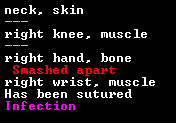

The History of ùkidek
=====================

Year 4 of ùkidek, diary of baron Grahar Vabôktad
------------------------------------------------

### 1st Granite, 253

I've been thinking. Now that I am a baron, I will probably never get to found a peaceful, prosperous fortress in the middle of nowhere. I'm stuck here, threatened by necromancers and the ever advancing threat of the war front. Well, there is an old proverb in the Unions of Bath, our allied human civilization: ”When life gives you muck roots, make swamp whiskey.“

If I want to have a good life here, we need three things:
- outer security, which includes trained and equipped fighters
- inner security, which includes happy dwarves and a working legal system
- prosperity

Unfortunately, I am not the overseer and only have limited power right now. So I better

I was just interrupted by one of our peasants. I can't remember her name (it's probably Urist or something like that). She told me they don't have any volunteers for a new overseer, so I have to take over the job. Perfect!

#### Addition

I spent most of today to get up to date on what is going on in the fortress. For the last two years, I mostly relayed work orders and took inventory, so I was not really up to whatever important stuff was going on.

#### nobility and holdings

Most importantly, I found out that I am not the only baron in ùkidek. Aban Momuzdeduk, the baron of Machineflashed and his wife reside here as well. Machineflashed is apparently a medium-sized hillocks. Aban migrated to ùkidek before he became baron. When his father died last summer, he was the replacement. I asked him he wanted to return to Machineflashed. He doesn't. He said he never lived in Machineflashed, and neither did his father.

Aban also told me that barons have the right to have much nicer rooms than both of us have today.

Oh, did I mention that Aban has a bedroom fit for a king? He has this legendary armor stand is his bedroom. Unbelievable! I am *the* baron of Dinnerbrains. He ist just a baron of some unimportant Hillocks he doesn't even care for.

Alåth the mayor also complained about his dining room. We need some larger rooms with high-value furniture. The current situation is unbearable.

#### Happiness

After the Sazir incident last year, it became evident that our dwarves need a way to relieve stress. We currenlty have no assigned performer in our inn. Our inn is also to small, I get complains about crowded tables.

All the animal skeletons left outside are also a problem. Some of them are even the remains of pets, which is a bit traumatizing for some of our weaker minded. Not to mention that having half a dozen skeletons lying outside is a considerable threat, given that we have already been attacked by necromancers twice.

There are several Workshops outside, which means dwarves have to work outside. **Outside!** No wonder everyone here is traumatized. Even the children play outside!

We also have only one kind of booze and are quickly running out of it.

Our biggest morality problem however is that we don't have a place to pray. This needs to be changed quickly.

So, four steps do be done:
1. create a temple for everyone who wants to worship any kind of god.
2. create three temples for the most worshipped gods in our fortress
3. clean up the outside, move the workshops inside
4. produce a larger variety of brewable crops
5. dig another, larger dining hall in addition to the existing one

#### Security

As mentioned before, childs play outside, dwarves work outside. The outside is covered in animal skeletons just waiting for a necromancer to appear.

Our melee militia is completely unequipped and untrained. Our only qualified carpenter is part of the militia. We need her, we cannot affort to lose her.

The fortress guard on the other hand is at least equipped with leather armor (well, as far as we have leather armor) and weapons. On the other hand, some of our most skilled Stoneworkers are part of the fortress guard! Also, the captain of the guard keeps complaining about having no prison for criminals. We have no prison. We need to dig out some room for one.

At least our marksdwarves are equipped and training. The zombie-shooting-range is still not working, but we can fix that.

Regarding the weapons and other equipment, we need a forge first. However, we have not struck magma yet. We need to dig deeper. And there is a rumour about a monster in the first cavern layer. After investigating these rumours, I got the following description:

”How do you know its appearance?“ I asked the bard who told me about it. Have you seen it? ”Of course not“, he answered, ”Overseer Gusto walled of this whole cavern. That was before the beast appeared“.

”Then how do you know how it looks like?“ He shrugged. ”Experienced miners can feel the vibration of the rock and can tell the shape of monsters.“

Maybe I shouldn't have asked. However, until our militia is better trained and equipped, I will not open the cavern again. Better safe than sorry.

#### Prosperity

We need more space to produce stuff and store the raw materials. Most importantly, we need to get to the magma sea to build smelters and forges. A pottery and a glas furnace may also help to produce high-value trade goods and furniture.

As mentioned before, we also need a larger variety of booze. And more booze. We only have 41 servings left, with a fortress population of 137 (including resident performers, but not including short-time visitors). At this rate, we will be dry by the end of the month. We also have a gigantic plump helmet field and over six hundred plump helmets. We should replace this with several smaller but more diverse farm plots.

We also have lots of mussel shells lying around. Maybe we can craft some trinkets with them. I don't want to imagine what those necromancers will do if they raise over a hundred mussel shells at the same time. This is scary.

So, long story short:
1. dig to the lava sea
2. build forges and smelters
3. optimize booze production
4. replace the plump helmet plot with a more diverse field
5. Make shell crafts
6. start a pottery and glassmaking industry

#### Dead Bards

After reorganizing some labours (especially reducing the number of our fisherdwarves to one), the peasant was at my door againm asking me what to do with the dead bards. Apparently, some bards dropped dead, dying of old age. I told her to just bury them, but she told me there weren't any empty graves left. She knows more about what's going on in this fortress than me. Maybe I should make her my assistant.

I just sent her away, with a production order for more coffins when the shouting started.

I ordered everyone inside. On their flight, our people counted some more intruders. Necromancers! Just as I feared. But before they got to raise our killed livestock, they fled.

Not a moment to soon, it seemed:

The Gates close with a loud **THUNK**. One of the last people to get in was the elven diplomat, scolding me about cutting trees. As if I had no other problems. What a day.

### 4st Granite, 253

From various reports I gathered an approximate number of enemies:

- 25 goblin soldiers, riding on
- 25 beak dogs
- 10 trolls
- 14 elves, part of the performance troupe ”The Calm Cacti“ (or maybe they just have a bad timing).

Right now, we can hear the agonizing sound of our livestock and pets being killed. Why were the pigs outside anyways? They don't even need the grass!. I order our miners to dig an underground pasture for the next time some goblins arrive.

Oh, and I also orderd Lolor's bedroom to be walled off. It still had a hole in the ceiling, leading outside. The problem with the workshops outside solved itself, by the way. The trolls destroyed them.

### 7th Granite, 253

It has become silent outside. What are they planning to do?

### 10th Granite, 253

We are almost out of booze, and since our only water supply is outside, we need to see if the goblins actually left.

### 11th Granite, 253

Outside is a stinking hell of rotting cadavers. The goblins killed all of our livestock that was outside, a wild elephant and some visiting human fighters. All in all, they only lost three trolls to traps. I don't know why they are gone. The elven performance troupe was not attacked.

On the plus side, we opened the gates just in time for the elven caravan to arrive. Most of their goods are useless, but right now we need booze. They also may have some useful trained animals. We need to replace our killed livestock.

Oh, and apparently, we have no crafts to sale. I ordered our stonecrafter to make some for the humans in the summer. For now, I will just sell prepared meals.

### 15th Granite, 253

The elves brought a frickin' grizzly bear! If they bring another one next year, we may even be able to breed them!. I also bought some fruit to have some variety in booze. I got this all for one pot of prepared meals. I even bought some wood from them because it was cheap and we may need to make charcoal to produce steel in the future.

### 16th Granite, 253

The new burial cave is dug out, the coffins are placed as I write this. They are below our living quarters. This is also where I will place our temples. Oh, did I mention we have no hospital yet? I recently replaced our chief medical dwarf with someone more experienced, but that does not help if there is no hospital.

### 23rd Granite, 253

Some migrants have arrived. I will sort them out later.

Ingish created a masterful statue of Lêgan, the god of truth. This will be the centerpiece of our new general temple. I also plan to create a temple for Ekurkidet, the goddess of suicide, death, war and fortresses. I think we need this temple.

The booze supply is still critically low, but we still manage to produce enough to not be totally dry. Oh, and we have cherry wine now. Alåth wanted to use it for her new roast recipe, but I prevented that.

### 24th Granite, 253

Whoa. We have about fourty immigrants. Some cattle and a donkey foal (which I immediatly placed on the new underground pasture), many children and some dwarves with weapon skills. A high master brewer (right on time), an adequate Blacksmith (better than nothing), two master mechanics and a great woodworker. All in all some great additions to the fortress. We need more rooms, though.

### 2nd Slate, 253

We make progress on many fronts. I have breached the second layer cavern again and ordered stairs to be built downwards. When that is done, I will wall the stairs off.

The main temple makes progress, the statue is about to be placed. We still need doors, though.

We enlarged the workshop area. I also ordered new baracks do be dug out, since we need the old baracks for workshops. I put the new baracks close to the entrance hall, so the militia can act quickly against an outside threat. We also have another melee squad. I intend to build baracks for them somewhere close to the cavern shaft, so they can act quickly against beasts from the cavern.

I just don't have the capacity to enlarge our inn now. But it is very crowded. See for yourself.

### 8th Slate, 253

Today I asked one of our resident animal trainers if they can train those caged dogs for war. Turned out those aren't dogs. They are dingoes. We can train them to not attack dwarves and livestock, but they will never be a war dog that is true to its master. Well, maybe we can breed them for meat.

### 9th Slate, 253

We breached the third cavern layer. And it's got a magma pool. This means we don't have to dig down all the way.

And even better! Gusto told me they found adamantine in that cavern! This is stuff of legends! I will wait before mining it though. It is only worth to be processed by the most legendary smiths.

### 11th Slate, 253

I don't want to dig further down before we sealed of the caverns. Instead, I orderd some new rooms to be dug out.

### 12th Slate, 253

The main temple has been opened today. It still needs some smoothing, but we finally have a place to pray at.

### 2nd Felsite, 253

The miners have finished digging out the new rooms, so I can finally move on to get appropriate rooming. I also designated some rooms for the baron of Machineflashed. I designated them to be dug out west of the great hall.

I roughly plan to dig even more elaborate rooms on the layer below, in case the king ever decides to pay us a visit. That reminds me. I have some notes laying around here, some even from the visit of the outpost liaison in 250. Back then I was to busy to read them. I handed them over to my successor. The seal is still intact, though. Meh, can't be that important. I'll just read them tomorrow.

### 3rd Felsite, 253

Holy Lêgan!

> The king is dead, long live the queen!

I should *really* read those memos on time. King Fikodkadôl was killed in an elven attack in the early summer of 250, only three months after he sent me to found Dinnerbrains. His eldest daughter, Bëmbul Boatsholy became queen after him.

The king was twenty years younger than me. I am suddenly very happy that I am not in Bridgehill anymore.

### 9th Felsite, 253

The garbage drop that Gusto installed is finally in working order.

The garbage is on a floor hatch that can be opened with a lever. The garbage is dropped several stories. In the future, I would like to move it a few tiles to the east, so we can drop our garbage into the magma pool. For now, we just let it drop into an unused hole.

Here is how to empty it:
1. Make sure no one is in the garbage drop room
2. Lock the door to the garbage drop room
3. Pull the lever besides the garbage drop room twice
4. Unlock the door

I also marked the skeletons outside to be dumped. Less fooder for necromancers. 

### 15th Felsite, 253

The second and third cavern layers are now completely separated from our staircase. As soon as the miners finished digging out the noble quarters, we can start designing the smelter and forge area.

Our booze stock has been quadrupled since the start of the year. We now have about 160 servings of booze, which is not much, but we are on the right way. We also have more different kind of drinks, which is a nice change.

### 16th Felsite, 253

Aban, the baron of Machineflashed mandated the construction of two animal traps. What the hell do we need animal traps for? Catching vermin? They are completely useless. And I bet we can't even sell them, because he will impose an export ban on them once they are made.

### 25 Felsite, 253

I was just writing some work orders to get some magma safe flood gates, mechanisms and stone blocks made, when Chance, the previous Overseer, dropped in. By Lêgan, he looked horrible. Since we are lacking a hospital, his right hand has not healed correct. The nose is a lost case anyways. I assumed he wanted to talk to me about opening a hospital, but instead he told me about his idea for a pump stack to pump magma to one of the upper layers, so we don't have to walk deep down for our forges and smelters.

An intriguing thought. I called our engineers and asked for their opinions. They seemed happy about it. Called it a really cool project which they really want to do.

My usual translation from engineer-talk like this is: It is dangerous, costs more than it benefits, will take forever and will probably fail spectacularly and kill us all. I decided to postpone this experiment indefinitely.

### 28th Felsite, 253

While the stone detailers are busy smoothing my quarters, the miners are busy digging out more rooms and a hospital and the engineers are busy figuring out how to safely provide the forges with magma, I decided to put an end to the captured goblins. The original concept of using them as undead archery targets never really worked out. And now they have literally gone mad.

Two of them are running around with foam coming out of their mouths, willing to attack anyone without any thought of self perservation. One runs around babbling, completely out of his mind. Another one is stricken by melancholy and does not do anything anymore. Only one of them seems to somewhat same, but is throwing an tantrum right now.

### 1st Hematite, 253

The fight was short and gory. Our soldiers entered the room and made short work of this mess of former goblin soldiers. The necromancer did not try anything. Chance suspected he was unable to properly see them through two rows of fortifications. I plan to re-cage the necromancer later so we can make some other experiments with undead as archery targets later.

### 9th Hematite, 253

èzum Taddumat, a fish dissector withdrawed from society today. He is a novice stone detailer and a novice blacksmith. While I hope he will go in the blacksmith direction, he will probably try something with stones, since we have not forges yet. And no metal bars, besides one gold bar which we bought from a caravan.

### 10th Hematite, 253

A human caravan from Gil Bepa has arrived. Let's see what those long people brought us. I hope we have enough stone crafts now, so we don't need to sell any more food.

I am kind of busy because I am sorting my list of what we can sell, but… why do we have a barrel of cougar blood? Apparently, I bought it. I need to drink more alcohol. Being sober makes me stupid.

Oh, an èzum has claimed a craftsdwarf's workshop. The mussel one reserved for bone carving. I guess we won't get more mussel shell decorations before he finished whatever he is up to.

### 11th Hematite, 253

A human diplomat has arrived as well. It is Okgush Rinlasod, their law-giver as well. Still, he has to wait until I finished trading.

Oh, and the hospital has been dug out. I will add a sketch of it here once the furniture has been placed.

### 14th Hematite, 253

Okgush convinced me to meet him right away. He mostly talked about the war they have the Familial Wisps, the elves that are still friendly to us and sold us the grizzly bear earlier this year. The rest was small talk. It was a bit embarassing that we had to meet in my old office, but my new throne room is not furnished yet. But now… let's go shopping.

### 15th Hemamtite, 253

I bought some common and precious cut gems, some bars of metal of different kinds, some alcoholic beverages (we are still low on alcohol). I decided to not buy more animals, because our underground pastures are rather small at this time.

I also bought many bins of cloth and leather. We do not produce cloth at all and leather only in an insignificant amount. We may need it though. If I want to get a glass industry running, we need to collect sand in bags. The few bags we have are not even sufficient for our threshers to but our quarry bush leaves in.

We are now out of stone crafts and had to throw in a few barrels of prepared meals as well. However, once we have a potter and a glasmaker, we will have more than enough useless crap to sell.

Oh, and the hospital is furnished. The walls are still rough, but we will fix this in time. For now, are least Chance's hand can be treated. His dedication to duty is admirable. If my hand was crushed when I was an overseer, the first thing I would have done is to mandate the construction of a hospital. He ran around with this gruesome wound for several months.

Let's just hope the unsanitary conditions in the hospital won't give him an infection. Right now, we don't even have soap.

### 16th Hematite, 253

I bought some thread from the humans after Rigòth, our chief medical dwarf complained that he can't suture Chance's wound without thread. I also bought some cheese and some plants so we can replace the food we sold to the humans.

èmuz has not started working yet. He scribbles the pictures of rough gems, skeletons, a quarry, leather and cloth on the walls of the workshop. I guess he still needs material. We have all of that material except bones. Maybe I can get a butcher to disassemble the elephant skeleton that the goblins left outside. If not, we need to slaughter one of our other animals.

### 18th Hematite, 253

I ordered a boar to be slaughtered.

### 20th Hematite, 253

Chance's hand wound has been sutured and dressed. Unfortunately, his hand was infected. I hope he will pull through. In any case, we need some soap. Once the forges ar build, I will put a side focus to soap production. For the record, here is the report from our chief medical dwarf about Chance's wounds:

### 21st Hematite, 253

Since I'm trying to build a sealable entrance to the third cavern layer to breach the magma pool and supply our forges with magma, our miners are only working some of their time. To better use their abilities, I let them start digging out some rooms for a potential royal visit.

In contrast to my original plans, I did not designate the royal quarters below my quarters. Instead, I am building them in the marble layers. This has two advantages:
1. the royal quarters are made of marble and therefore worth more than our mudstone quarters
2. we need marble anyways, since we can use it as flux material for steel production

### 24th Hematite

èzum Taddumat has started working on his big project. The materials he has are mudstone, two jet rocks, yak cow bone, giant cave spider silk, boar bone, harlequin opals, cat leather, more harlequin opals and koala leather. I' curious.

### 25th Hematite, 253

Oh carp. It seems we have a vampire among us. When Kadol did not appeared to work today, someone looked in his room and found him drained of blood. Kadol was a good friend of mine, one of guys I brought along when I was sent to found this fortress. Even worse, he was our only architect. How can we build our security bridges without him?

We have to find the vampire and bring them to justice. Unfortunately, we don't even have a jail yet.

I appointed Likot, another Mechanic to be our new architect. Better than nothing.

### 28th Hematite, 253

èzum finished his artifact:

He claimed it as family heirloom, but he will probably accept if we display this work in a temple of Nanir (once we have one).

Still no clue who the vampire is.

### 9th Malachite, 253

A migrant has arrived. A single one. But he is a high master suturer and wound dresser and most importantly: an architect.

### 13th Malachite, 253

Our booze stock is shrinking again. I decided to streamline the process. Right now, we don't have a dedicated stockpile for ra materials for cooking or brewing. I will change that. I will also set up a stockpile for empty pots and barrels, as well as a larder for prepared meals and beverages.

### 14th Malachite, 253

Our first batch 30 portions of charcoal has been finished. I will set up an order to produce charcoal whenever we have less than 60 units of refined fuel and at least 60 wood logs.

I also ordered to make some ash, the first step to make soap.

### 17th Malachite, 253

The bridge to lock off the third cavern layer has been built. It is a retracting bridge that blocks the cavern if the bridge is not retracted. It will be connected to a lever in the north-west of our dining hall.

### 23rd Malachite, 253

I designated tombs for Gusto and Chance. Former overseers deserve a dedicated burial place. I also ordered the construction of some marble statues of all former and present overseers.

### 27th Malachite, 253

My new quarters are finally furnitured and smoothed. So are Aban's quarters. He still wants those animal traps to be made though. He shouldn't even have the right to mandate productions. Anyways, our carpenter has neglected to make the animal traps so far.

### 6th Galena, 253

We breached the third cavern layer for the second time. I ordered the militia to watch out for threats. There are some interesting-looking giant fungi down there. I ordered some of them to be cut down. Better than this boring above-ground wood.

The next steps are to build some walls to direct the magma to where we want it and channel into the wall of the magma pool.

### 17th Galena, 253

The blood of the earth is flowing. Before I flood the tubes below our forges, here are some schematics how the tubes work:

There are two floodgates to the magma tubes. The one in the east is for flooding the magma tubes, the one in the west is for draining them. In the layer above are the forges. North and south of the staircase are labelled levers to controll those floodgates.

Thats enough talking. Let the magma flow!

### 21st Galena, 253

The magma is slowly flowing through the tubes. Soon we can start a proper metal industry.

Oh, and we caught some elk birds in the third cavern layer. Maybe we can train and breed them.

### 27th Galena, 253

The magma forges and smelters are now supplied with magma. Right now, we only have one furnace operator, so I told one recently grown up peasant to learn furnace operating. Another recently grown up peasant gets to become the our weapon smith. If we have to train a weapon smith, we may as well train someone who has a lot time to live.

### 4th Limestone, 253

While waiting for the metal industry to take off, I started preparing some stuff for our glass and ceramics production. I dug out two rooms to collect sand and clay, another room for the workshops with the tools for collection and a new area for leather and cloth processing. I already ordered to make some bags for collecting sand.

Now I only need a potter and a glassmaker. I already have someone in mind as potter, but for glassmaking… well, where is my lit of citizens? Eeny, meeny, miny, moe…
